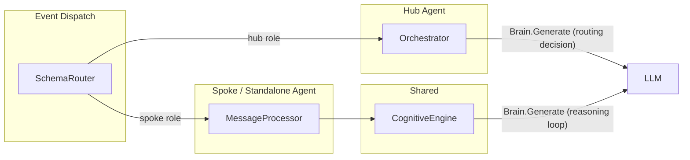

# Agent Brain Architecture

> Last updated: M6

## Prerequisites

- Familiarity with the [Architecture Overview](./overview.md) — system context, component responsibilities, communication matrix.
- Understanding of Hub-Spoke community topology (SPEC-FR-M6.1) and NATS inter-agent messaging (SPEC-FR-M6.2, SPEC-FR-M6.3).
- Related specifications: `SPEC-FR-M5.*` (Agent Core), `SPEC-FR-M6.*` (Communities & Messaging).

## Purpose

This document describes the internal cognitive architecture of the Agent component — the processing engines that handle individual reasoning, hub-spoke orchestration, and inter-agent delegation. It explains how an agent receives an event, decides what to do, and produces a response.

## Domain Model Layer

The agent's domain model (`internal/agent/domain/model/`) defines the core value objects that flow through all processing engines. These types are pure business objects with validation logic and no infrastructure imports.

| Model | File | Purpose |
|-------|------|---------|
| `BrainRequest` / `BrainResponse` | [brain.go](../../internal/agent/domain/model/brain.go) | LLM call envelope: prompt, system prompt, history, tools, temperature. Response: content, token usage, finish reason, tool calls. |
| `ToolDefinition` / `ToolCall` | [brain.go](../../internal/agent/domain/model/brain.go) | Tool metadata exposed to the LLM (JSON Schema) and specific tool invocation results. |
| `AgentReasoningStepPayload` | [reasoning.go](../../internal/agent/domain/model/reasoning.go) | A single granular step in the ReAct loop: thought, action (tool call), and observation. |
| `OrchestrationState` | [orchestration.go](../../internal/agent/domain/model/orchestration.go) | Hub orchestration state: thread/community binding, pending spokes map, loop count safeguard. |
| `MemoryEntry` | [memory.go](../../internal/agent/domain/model/memory.go) | Short-term memory entry with role (`system`, `user`, `assistant`, `tool`), content, timestamp, and metadata. |
| `LTMEntry` / `LTMFilter` | [ltm.go](../../internal/agent/domain/model/ltm.go) | Long-term memory: UUID, embedding vector, type classification (`conversation`, `document`, `fact`, `procedural`), visibility scoping. |

## Processing Engines

The agent has three distinct processing engines, each with a different cognitive role:



### CognitiveEngine — Individual Agent Reasoning Loop

**File**: [cognitive_engine.go](../../internal/agent/application/service/cognitive_engine.go)

The CognitiveEngine implements a ReAct-style (Reasoning + Acting) loop for individual agents. It is used by both standalone agents and spoke agents to process a user query step-by-step.

```
User Query + History
      │
      ▼
┌─────────────────┐
│  BrainRequest    │ ──► LLM Generate
│  (prompt, tools) │
└─────────────────┘
      │
      ▼
┌─────────────────┐    Yes    ┌──────────────┐
│  Tool Calls?     │ ────────►│ Execute Tools │
│                  │          │ (registry)    │
└─────────────────┘          └──────────────┘
      │ No                         │
      ▼                            ▼
┌─────────────────┐    ┌──────────────────────┐
│  Return Final    │    │ Append Observation    │
│  Answer          │    │ to History, Continue  │
└─────────────────┘    └──────────────────────┘
```

**Key behaviors:**

- **Tool Registry**: Request-scoped map of tool handlers. Built-in tools (`recall_memory`, `enable_skill`, `read_large_payload`, `write_large_payload`) are registered at construction; MCP tools are dynamically discovered and added.
- **Skills System**: The `enable_skill` tool dynamically injects procedural knowledge (skill content) into the conversation mid-loop, allowing the agent to adapt its behavior based on the task.
- **LTM Recall**: The `recall_memory` tool performs semantic vector search against Qdrant, returning relevant long-term memories above a configurable similarity threshold.
- **Max Steps Safeguard**: A configurable `maxSteps` limit prevents infinite reasoning loops. When exceeded, the last thought is returned as a fallback.
- **OTel Instrumentation**: Each reasoning step gets its own OTel sub-span with thought, action, and observation attributes.
- **NATS Step Emission**: Intermediate reasoning steps are published to `ts.tenant.{tenant_id}.agent.{agent_id}.thread.{thread_id}.reasoning` for real-time UI streaming.

### Orchestrator — Hub Agent Routing Brain

**File**: [orchestrator.go](../../internal/agent/application/service/orchestrator.go)

The Orchestrator is the coordination brain used exclusively by Hub agents in a Hub-Spoke community. It decides whether to delegate work to spoke agents or finalize a response to the user.

```
User Message
      │
      ▼
┌──────────────────────┐
│ Acquire Thread Lock   │
│ Discover Spoke Cards  │
│ Initialize State      │
└──────────────────────┘
      │
      ▼
┌──────────────────────┐
│ runOrchestrationTurn  │ ◄────────────────────┐
│  • Fetch STM history  │                      │
│  • Compile hub prompt │                      │
│  • Brain.Generate     │                      │
└──────────────────────┘                       │
      │                                        │
      ▼                                        │
  ┌───────────┐                                │
  │  Action?   │                               │
  ├───────────┤                                │
  │ delegate   │──► Fan-out tasks to Spokes    │
  │            │    via NATS delegation events  │
  │            │    Yield and wait              │
  │            │         │                     │
  │            │         ▼                     │
  │            │    Spoke Response(s) arrive    │
  │            │         │                     │
  │            │    All spokes replied? ────Yes─┘
  ├───────────┤
  │ finalize   │──► Polish → Publish Final Response
  └───────────┘
```

**Key behaviors:**

- **JSON Schema Contract**: The LLM is instructed to output structured JSON: `{"action": "delegate"|"finalize", "spokes": [...], "response": "..."}`.
- **Fan-out / Fan-in**: Multiple spokes can be delegated concurrently. The orchestrator tracks pending spokes in a map and waits for all to reply before proceeding.
- **Loop Detection**: `MaxLoops = len(spokes) + 3`. If exceeded, the orchestrator force-finalizes with the latest spoke response.
- **Handoff Detection**: Spoke responses containing `suggest_handoff` trigger coordinated re-delegation to a different spoke.
- **Spoke Name Normalization**: Case-insensitive matching against discovered agent card names ensures correct NATS subject routing.
- **Progression Events**: Intermediate `AgentReasoning` events are emitted for UI progress updates (e.g., "Delegating tasks to: [Agent-A, Agent-B]...").
- **Human-Readable Polishing**: Final answers are passed through an `ensureHumanReadable` brain call to strip any raw JSON or observation artifacts.

### MessageProcessorService — Standalone/Spoke Agent Pipeline

**File**: [message_processor.go](../../internal/agent/application/service/message_processor.go)

The MessageProcessor is the entry point for non-hub agents (standalone and spoke). It orchestrates the full pipeline from message receipt to response.

```
Incoming Message
      │
      ▼
 Fetch STM History (prior turns)
      │
      ▼
 Append User Turn to STM
      │
      ▼
 CognitiveEngine.ExecuteReasoningLoop
      │
      ▼
 Append Assistant Turn to STM
      │
      ▼
 STM > Limit? ──Yes──► Async Memory Consolidation (summarize → embed → save to Qdrant LTM)
      │
      ▼
 Return Response
```

**Key behaviors:**

- **Passive Eviction**: When STM exceeds the configured limit, oldest turns are summarized via the Brain, embedded into a vector, and saved to Qdrant LTM asynchronously (goroutine with `context.WithoutCancel`).
- **Graceful Degradation**: STM and LTM failures are non-fatal — the engine falls back to empty history or skips consolidation.

## Event Dispatch — Schema Router

**File**: [schema_router_impl.go](../../internal/agent/application/service/schema_router_impl.go)

The SchemaRouter is the NATS event dispatcher. It routes incoming domain events to the correct processing engine based on the agent's role.

| Schema | Hub Agent | Spoke/Standalone Agent |
|--------|-----------|------------------------|
| `start-thread` | Clear STM for thread | Clear STM for thread |
| `add-user-message` | → Orchestrator | → MessageProcessor |
| `agent-delegation` | → Orchestrator (as user message) | → MessageProcessor (with ContextHistory sync) |
| `agent-spoke-response` | → Orchestrator (spoke reply) | *(not handled)* |
| `end-thread` | Consolidate STM → LTM, clear STM | Consolidate STM → LTM, clear STM |

When a spoke agent receives a delegation event, the SchemaRouter first synchronizes its Short-Term Memory with the incoming `ContextHistory` from the hub, then processes the delegated message through the standard MessageProcessor pipeline.

## Outbound Port Interfaces

The application layer depends exclusively on these outbound port interfaces, maintaining clean hexagonal boundaries:

| Port | File | Purpose |
|------|------|---------|
| `Brain` | [brain.go](../../internal/agent/application/ports/outbound/brain.go) | LLM generation (sync + streaming) |
| `ShortTermMemory` | [memory.go](../../internal/agent/application/ports/outbound/memory.go) | Redis-backed conversation history (append, get, clear, rollback) |
| `LongTermMemory` | [ltm.go](../../internal/agent/application/ports/outbound/ltm.go) | Qdrant vector store (save, search) |
| `Embedder` | [embedder.go](../../internal/agent/application/ports/outbound/embedder.go) | Text → embedding vector generation |
| `EventPublisher` | [publisher.go](../../internal/agent/application/ports/outbound/publisher.go) | NATS event publishing |
| `OrchestrationStateStore` | [orchestration.go](../../internal/agent/application/ports/outbound/orchestration.go) | Redis-backed orchestration state (save, get, clear) |
| `ThreadLock` | [orchestration.go](../../internal/agent/application/ports/outbound/orchestration.go) | Distributed locking for thread-level concurrency control |
| `AgentDiscovery` | [orchestration.go](../../internal/agent/application/ports/outbound/orchestration.go) | Cache-backed spoke agent card discovery |
| `ToolExecutor` | [tool_executor.go](../../internal/agent/application/ports/outbound/tool_executor.go) | MCP tool execution (stdio/SSE transports) |

## Related Documents

- [Architecture Overview](./overview.md)
- [Hexagonal Layering](./hexagonal.md)
- [Data Flows](./data-flow.md)
- [Context Propagation](./context-propagation.md)
