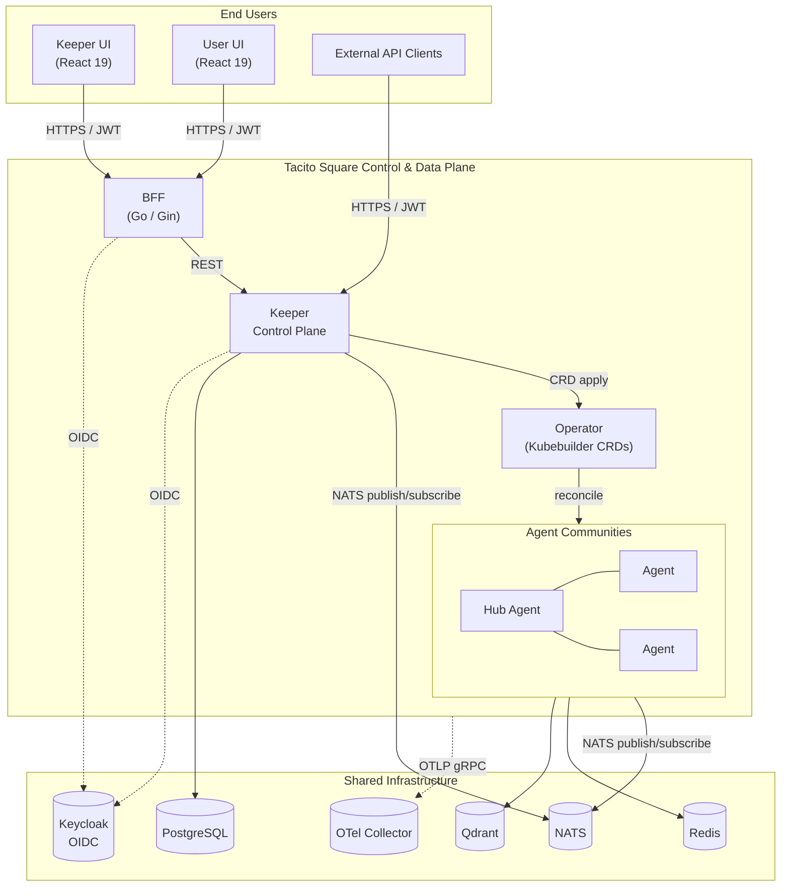

# Architecture Overview

> Last updated: M9

## Prerequisites

- Familiarity with the project [README](../../README.md) — workspace layout, components, technology stack.
- Conceptual knowledge of Kubernetes (Deployments, CRDs, Operators), NATS subject-based messaging, and OIDC bearer-token authentication.
- Related specifications: `SPEC-FR-M1.*` (infrastructure), `SPEC-FR-M3.*` (Keeper), `SPEC-FR-M4.*` (Operator), `SPEC-FR-M5.*` (Agent), `SPEC-FR-M7.*` (BFF).

## Purpose

This document provides a high-level architectural view of Tacito Square. It is the entry point for the `docs/architecture/` set; deeper concerns (context propagation, hexagonal layering, data flows, multitenancy, observability) are covered in dedicated companion documents.

## System Context

Tacito Square is a Kubernetes-native multi-agent platform. Four first-class Go components — built around a shared hexagonal layout (`domain/`, `application/`, `adapters/`) and bootstrapped from `cmd/<component>/main.go` via per-component `internal/<component>/bootstrap.go` — cooperate to spawn, configure, and run autonomous AI agents that collaborate in communities through structured protocols.

The Operator reconciles a single Custom Resource — `TacitoAgent` (`tacito.<group>/v1alpha1`, defined in [pkg/kubernetes/apis/tacito/v1alpha1/tacitoagent_types.go](../../pkg/kubernetes/apis/tacito/v1alpha1/tacitoagent_types.go)) — whose phases are `Pending`, `Running`, `Idle`, `Terminated` and which exposes the `scale` subresource so HPAs can drive replica counts.

## Component Responsibilities

| Component | Bounded Context | Primary Responsibilities | Persistence |
|-----------|-----------------|--------------------------|-------------|
| **Agent** ([internal/agent](../../internal/agent)) | Reasoning & action | Stateless worker pod. The cognitive engine ([cognitive_engine.go](../../internal/agent/application/service/cognitive_engine.go)) and message processor ([message_processor.go](../../internal/agent/application/service/message_processor.go)) drive LLM reasoning via outbound adapters for OpenAI / Ollama, short-term memory via Redis, long-term recall via Qdrant. Inbound NATS subscribers (e.g. [echo_subscriber.go](../../internal/agent/adapters/inbound/nats/echo_subscriber.go)) accept community messages. | Redis (STM), Qdrant (LTM) |
| **Keeper** ([internal/keeper](../../internal/keeper)) | Control plane | Catalog and orchestration of LLM bindings, MCP servers, prompts, skills, agents and communities. HTTP handlers in [adapters/inbound/http](../../internal/keeper/adapters/inbound/http) expose the REST API; outbound adapters split into [postgres/](../../internal/keeper/adapters/outbound/postgres) (entity repositories + [transaction.go](../../internal/keeper/adapters/outbound/postgres/transaction.go)), [crd/](../../internal/keeper/adapters/outbound/crd) ([crd_coordinator.go](../../internal/keeper/adapters/outbound/crd/crd_coordinator.go)) for Operator handoff, and [nats/](../../internal/keeper/adapters/outbound/nats) ([community_broadcaster.go](../../internal/keeper/adapters/outbound/nats/community_broadcaster.go)) for runtime messaging. | PostgreSQL |
| **Operator** ([internal/operator](../../internal/operator)) | Cluster reconciliation | Kubebuilder controller. The reconciliation loop in [reconciler.go](../../internal/operator/adapters/inbound/reconciler.go) translates `TacitoAgent` specs into Kubernetes Deployments / ConfigMaps / Secrets and reports lifecycle phase + replica counts back on `.status`. | Kubernetes etcd (via API server) |
| **BFF** ([internal/bff](../../internal/bff)) | Frontend aggregation | Backend-for-frontend serving the Keeper and User UIs. Validates JWTs, aggregates Keeper REST calls, performs API shaping for the React clients. | Stateless |

## Communication Matrix

The two primary inter-component channels are HTTP/REST (synchronous, request/response) and NATS (asynchronous, subject-based). Kubernetes API access is used exclusively by the Operator.

| From → To | Channel | Protocol | Purpose |
|-----------|---------|----------|---------|
| UI → BFF | REST | HTTPS + JWT | UI-driven configuration and lifecycle calls |
| BFF → Keeper | REST | HTTP + JWT | Aggregated control-plane operations |
| External Client → Keeper | REST | HTTPS + JWT | API-first integrations and A2A gateway |
| Keeper → Kubernetes API | K8s API | HTTPS + ServiceAccount | `TacitoAgent` create/update/delete via the CRD coordinator adapter |
| Operator → Kubernetes API | K8s API + Watch | HTTPS + ServiceAccount | Reconciliation of `TacitoAgent` into Deployments/ConfigMaps; status / scale subresource updates |
| Keeper ↔ Agent | NATS | Subject pub/sub + headers | Echo / message dispatch and replies via `community_broadcaster` (Keeper) and the agent NATS subscribers |
| Agent ↔ Agent (within community) | NATS | Subject pub/sub | Hub-Spoke / Mesh / Pipeline protocols |
| Keeper / BFF → Keycloak | OIDC | HTTPS | JWT signature verification, token introspection |
| All components → OTel Collector | OTLP | gRPC | Trace and metric export |
| Agent → Redis | TCP | RESP | Short-term memory |
| Agent → Qdrant | gRPC/HTTP | — | Long-term vector memory |
| Keeper → PostgreSQL | TCP | pgx | Catalog and audit persistence |

## Implementation Map

The following anchors connect the architecture to the actual repository layout. Each component follows the same hexagonal split (`domain/model`, `application/{ports,service}`, `adapters/{inbound,outbound}`); cross-cutting concerns live under [internal/shared](../../internal/shared).

| Concern | Location |
|---------|----------|
| Component bootstrap (DI wiring) | [cmd/keeper/main.go](../../cmd/keeper/main.go), [cmd/operator/main.go](../../cmd/operator/main.go), [cmd/agent/main.go](../../cmd/agent/main.go), [cmd/bff/main.go](../../cmd/bff/main.go) and the matching `internal/<component>/bootstrap.go` |
| Keeper domain model | [internal/keeper/domain/model](../../internal/keeper/domain/model) — `agent`, `community`, `llm_binding`, `mcp_server`, `prompt`, `skill`, `echo` |
| Keeper REST handlers | [internal/keeper/adapters/inbound/http](../../internal/keeper/adapters/inbound/http) (one handler file per resource + [middleware.go](../../internal/keeper/adapters/inbound/http/middleware.go)) |
| Keeper application services | [internal/keeper/application/service](../../internal/keeper/application/service) |
| Agent reasoning loop | [internal/agent/application/service/cognitive_engine.go](../../internal/agent/application/service/cognitive_engine.go), [message_processor.go](../../internal/agent/application/service/message_processor.go) |
| Agent outbound adapters | [internal/agent/adapters/outbound](../../internal/agent/adapters/outbound) — `nats`, `openai`, `ollama`, `qdrant`, `redis`, `resiliency` |
| `TacitoAgent` CRD types | [pkg/kubernetes/apis/tacito/v1alpha1/tacitoagent_types.go](../../pkg/kubernetes/apis/tacito/v1alpha1/tacitoagent_types.go) |
| Operator reconciler | [internal/operator/adapters/inbound/reconciler.go](../../internal/operator/adapters/inbound/reconciler.go) |
| Auth (OIDC) | [internal/shared/auth/auth.go](../../internal/shared/auth/auth.go) |
| Tenant resolution | [internal/shared/tenant/tenant.go](../../internal/shared/tenant/tenant.go) |
| Observability primitives | [internal/shared/observability](../../internal/shared/observability) — `tracing.go`, `gin_tracing.go`, `nats_tracing.go`, `db_tracing.go`, `logger.go`, `metrics.go` |
| Shared outbound ports | [internal/shared/ports/outbound](../../internal/shared/ports/outbound) — `blobstore.go`, `cache.go` |

## Deployment Topology

Tacito Square is delivered as two Helm charts (see `tools/helm/tacito-square-infra/` and `tools/helm/tacito-square/`).

- **Shared multi-tenant components** (one deployment per cluster, multi-tenant via header/JWT): Keeper, BFF, Operator, public API gateways.
- **Dedicated single-tenant components** (one deployment unit per tenant, isolated by namespace and labels): Agents and AgentCommunities, materialized by the Operator from CRDs.

Multi-tenancy and isolation guarantees are detailed in [`multitenancy.md`](./multitenancy.md).

## Cross-Cutting Concerns

Each concern is owned by a dedicated companion document:

- **Layering & dependency rule** — see [`hexagonal.md`](./hexagonal.md): `domain/model` ← `application/ports` ← `adapters`.
- **Request, tenant and trace propagation** — see [`context-propagation.md`](./context-propagation.md): `trace_id`, `tenant_id`, OTel `traceparent` flow across HTTP and NATS boundaries.
- **End-to-end flows** — see [`data-flow.md`](./data-flow.md): agent spawn lifecycle, message echo flow, community creation.
- **Multitenancy** — see [`multitenancy.md`](./multitenancy.md).
- **Observability pipeline** — see [`observability.md`](./observability.md): metrics, traces, logs.

## Key Design Decisions

| Decision | Rationale |
|----------|-----------|
| Stateless agents as plain K8s Deployments | Go's sub-second cold start eliminates the need for warm pools; agents are configured at runtime via ConfigMaps/Secrets. |
| Hexagonal architecture in every component | Domain logic stays decoupled from infrastructure; LLMs, memory stores, messaging, and tools are all behind ports. |
| API-first | All functionality is reachable via authenticated REST APIs; UIs are optional consumers, not gatekeepers. |
| OpenAPI as a published contract | Each component serves its live spec at `GET /openapi.json` and a committed copy lives in `api/openapi/`. |
| NATS for inter-agent and Keeper↔Agent traffic | Subject-based pub/sub enables Hub-Spoke, Mesh and Pipeline community topologies without bespoke brokers. |
| Independent component versioning | Each component owns a `VERSION.<component>` file; cross-component contracts are governed by OpenAPI versions. |

## Related Documents

- [Project README](../../README.md)
- [Hexagonal layering](./hexagonal.md)
- [Context propagation](./context-propagation.md)
- [Data flows](./data-flow.md)
- [Multitenancy](./multitenancy.md)
- [Observability](./observability.md)
