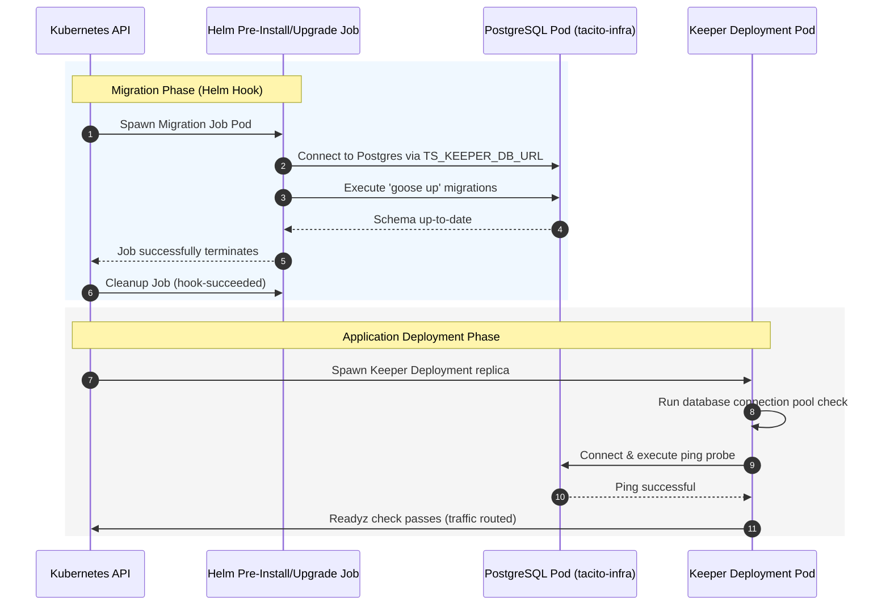

# SPEC-FR-M3.8: PostgreSQL Persistence & Migrations

| Field         | Value                                       |
|---------------|---------------------------------------------|
| ID            | SPEC-FR-M3.8                                |
| Status        | IN_PROGRESS                                 |
| Milestone     | M3                                          |
| Component     | keeper                                      |
| Depends On    | SPEC-FR-M3.1, SPEC-FR-M3.2, SPEC-FR-M3.3, SPEC-FR-M3.4, SPEC-FR-M3.5, SPEC-FR-M3.6, SPEC-FR-M3.7 |
| Supersedes    | none                                        |

---

## Context

Tacito Square components, in particular the **Keeper** orchestrator, require high-performance, transaction-safe, and multi-tenant isolated durable persistence. Additionally, local development, CI validation, and production Helm-based Kubernetes deployments need a robust, automated database migration strategy.

This specification consolidates both the Go application database layer and the Kubernetes/Helm binding architecture, ensuring migrations execute safely before services start and connections are securely established, traced, and monitored in a clean hexagonal and multitenant isolated structure.

---

## Specification

### 1. Persistent Layer Architecture & Outbound Adapters
- The keeper persistence layer MUST utilize **pgx/v5** (`github.com/jackc/pgx/v5`) as the core database driver and connection pool orchestrator. 
- Direct query/relational operations are handled explicitly in Go database adapters utilizing safe, prepared parameter-binding queries.
  - All database adapter methods MUST accept `context.Context` to propagate deadlines, cancellations, and parent trace contexts.
- **Multi-Tenant Scoping**: All queries executing CRUD or assignment lookups MUST include strict tenant boundaries (`tenant_id = ?`) derived from the context. If a tenant attempts to lookup or mutate a resource belonging to another tenant, the adapter MUST return a "not found" error, which translates to a `404 Not Found` API response to prevent entity discovery.
- **Tenant Validation**: The HTTP handler middleware layer MUST validate tenant context resolved from OIDC claims or standard headers. If the tenant identity is missing or invalid, the middleware MUST abort the request immediately, returning a standard JSON payload carrying a `401 Unauthorized` status to ensure secure tenant isolation boundary compliance.

### 2. Transaction Port & Abstraction
- In compliance with the hexagonal architecture guidelines of `code-architecture.md`, the core application layer MUST NOT import or be coupled to database-specific transaction interfaces (like `pgx.Tx` or custom connection pools).
- Transactional safety for multi-stage use cases (such as Agent-Community assignments or transactional status updates) MUST be orchestrated via a decoupled port interface defined inside `internal/keeper/application/ports/outbound/`:
  ```go
  package outbound

  import "context"

  // TransactionRunner orchestrates transactional boundaries safely across hexagonal layers.
  type TransactionRunner interface {
      RunInTransaction(ctx context.Context, fn func(ctx context.Context) error) error
  }
  ```
- The implementation adapter (`adapters/outbound/postgres/transaction.go`) wraps the concrete `pgxpool.Pool` transaction handling. It propagates the transaction context safely downstream using Go's context so that nested repository operations seamlessly reuse the same active database transaction context.

### 3. Connection Pooling & Resiliency Defaults
- Connection pooling is managed via `pgxpool.Pool` inside the application bootstrapper.
- Pool options MUST support sensible configuration defaults:
  - `max_conns`: Default to `20` concurrent connections per replica.
  - `min_conns`: Default to `2` idle connections.
  - `max_conn_lifetime`: Default to `30m`.
  - `max_conn_idle_time`: Default to `5m`.
- The database connection string is passed via `TS_KEEPER_DB_URL` (or fallback `TS_DATABASE_URL` environment variables).

### 4. OpenTelemetry Database Tracing & Dependency Metrics
- **OTel Instrumentations**: Database operations MUST emit structured trace spans correlated to the active request context. Every SQL query MUST trigger a child span named `db.query` implementing standard OpenTelemetry database semantic conventions:
  - `db.system`: `postgresql`
  - `db.statement`: The parsed/sanitized SQL statement being executed.
  - The tracer MUST inject the parent span context into database operations so database client spans are properly nested under the incoming REST API handler span.
- **Outbound Dependency Durations**: Outbound database client interactions MUST be instrumented via the standard Prometheus histogram metric `outbound_dependency_duration_seconds`.
  - The metric MUST carry the labels: `dependency="postgresql"`, `operation` (e.g. `query`, `exec`, `transaction`), and `status` (e.g. `success`, `failure`).
  - Observations MUST capture duration metrics on database adapter operations.

### 5. Database Pool Status Metrics (Observability Integration)
- In compliance with the Prometheus metrics requirements of `SPEC-NFR-OBSERVABILITY`, the Keeper `/metrics` endpoint MUST expose active, real-time database connection pool state metrics.
- The following Prometheus metrics MUST be collected and exposed under the pgx connection pool:
  - `db_pool_acquired_connections` (Gauge): The number of active/acquired connections currently in use.
  - `db_pool_idle_connections` (Gauge): The number of currently idle/free connections in the pool.
  - `db_pool_total_connections` (Gauge): The total number of open connections currently in the pool.
  - `db_pool_max_connections` (Gauge): The maximum number of allowed connections in the pool (configured limit).
- These metrics MUST be registered via a custom Prometheus collector wrapping the active `pgxpool.Pool` connection statistics (`pool.Stat()`), executing dynamically on each scrape request.

### 6. Zero-Latency Bootstrapping & Multi-Dependency Probes
- **Deterministic Route Registration**: The Keeper HTTP server MUST unconditionally register all endpoints at boot time.
- **Graceful DB Availability Middleware**: 
  - Routes under `/api/v1` are guarded by a middleware that performs a fast pointer check on the database connection pool (`pool == nil`).
  - If the database was offline during bootstrap, incoming requests return a graceful `503 Service Unavailable` with `{"error": "Database service unavailable"}`, rather than crashing or hanging the router.
- **Liveness Probe (`/healthz`)**:
  - Expose `/healthz` returning standard `200 OK` (JSON format) to verify that the container process is alive. No external dependency checks are executed to avoid cascading failures.
- **Readiness Probe (`/readyz`)**:
  - Expose `/readyz` performing parallel connectivity pings to all downstream backing services (PostgreSQL, NATS, Redis, and Cache Redis) with a configurable timeout.
  - If all checks pass, return a `200 OK` JSON payload.
  - If any dependency check fails, return a `503 Service Unavailable` carrying a detailed JSON payload mapping the status/errors of each individual backing service (e.g., `{"postgres": "connected", "nats": "error: connection refused"}`) in compliance with `k8s-best-practices.md`.

---

## Helm Deployment & Migration Bindings

In Kubernetes deployments, database schema migrations and persistent state connectivity are tightly bound using Helm templates and secrets.



### 1. Connection & Persistence Binding
- **Secret Management**: Database passwords and URI connection strings MUST be stored inside a secure Kubernetes Secret, structured as:
  ```yaml
  apiVersion: v1
  kind: Secret
  metadata:
    name: {{ include "tacito-square.fullname" . }}-keeper-db
  type: Opaque
  data:
    password: {{ .Values.keeper.config.db.password | b64enc | quote }}
  ```
- **Environment Mapping**: The Keeper container in the Deployment spec binds environment variables from this secret:
  ```yaml
  env:
    - name: TS_KEEPER_DB_URL
      value: {{ .Values.keeper.config.db.url | quote }}
    - name: TS_KEEPER_DB_PASSWORD
      valueFrom:
        secretKeyRef:
          name: {{ include "tacito-square.fullname" . }}-keeper-db
          key: password
  ```

### 2. Pre-Deployment Database Migration Hook (Job Pattern)
To ensure the PostgreSQL database schema is fully migrated before any new application pod starts, the Helm chart MUST execute migrations via a Kubernetes **Job** utilizing **Helm Hooks**.

- **Job Template** (`templates/keeper/migration-job.yaml`):
  ```yaml
  apiVersion: batch/v1
  kind: Job
  metadata:
    name: {{ include "tacito-square.fullname" . }}-keeper-migrate
    labels:
      {{- include "tacito-square.labels" (dict "component" "keeper-migrate" "context" .) | nindent 6 }}
    annotations:
      "helm.sh/hook": pre-install,pre-upgrade
      "helm.sh/hook-weight": "5"
      "helm.sh/hook-delete-policy": before-hook-creation,hook-succeeded
  spec:
    template:
      metadata:
        name: {{ include "tacito-square.fullname" . }}-keeper-migrate
      spec:
        restartPolicy: OnFailure
        containers:
          - name: migrate
            image: {{ include "tacito-square.image" (dict "registry" .Values.keeper.image.registry "name" "tacito-square/keeper" "tag" .Values.keeper.image.tag "global" .Values.global) }}
            command: ["/app/keeper", "migrate", "up"]  # Executes Goose migration logic packaged in the image
            env:
              - name: TS_KEEPER_DB_URL
                value: {{ .Values.keeper.config.db.url | quote }}
              - name: TS_KEEPER_DB_PASSWORD
                valueFrom:
                  secretKeyRef:
                    name: {{ include "tacito-square.fullname" . }}-keeper-db
                    key: password
  ```

- **Alternative (Init Container Pattern)**:
  If a dedicated Helm Hook job is not desired, the chart MAY optionally bind migrations inside an `initContainer` inside the Keeper Deployment pod:
  ```yaml
  initContainers:
    - name: wait-and-migrate
      image: goose/goose:v3.18.0
      command: ["goose", "-dir", "/migrations", "postgres", "$(TS_KEEPER_DB_URL)", "up"]
      env:
        - name: TS_KEEPER_DB_URL
          value: {{ .Values.keeper.config.db.url | quote }}
  ```
  *The Job Pattern (Helm Hook) is the recommended standard because it isolates cluster admin permissions and keeps application pod startup times minimal.*

---

## Acceptance Criteria

1. **Transactional Invariant Consistency**: Transaction adapters cleanly rollback database changes on error during multi-stage assignments using context-propagated transaction primitives.
2. **Deterministic Route Initialization**: Keeper boots up and registers all HTTP endpoints successfully even if the database is unconfigured or unreachable.
3. **Graceful Error Middleware Propagation**: Endpoints return a structured `503 Service Unavailable` with `{"error": "Database service unavailable"}` when the postgres pool is offline.
4. **Active Correlation Spans**: All database client calls generate OpenTelemetry trace spans correlated to the active parent HTTP request `trace_id`.
5. **Pre-install Migration Hook**: Database migrations execute cleanly via a Helm `pre-install`/`pre-upgrade` Job before keeper pods are spawned in the cluster.
6. **Connection Encryption**: TLS is enforced for database connections by appending `sslmode=require` or similar parameters in Helm configuration blocks.
7. **Database Pool Metrics Exposition**: The `/metrics` endpoint exposes connection pool states (`db_pool_acquired_connections`, etc.) correctly registered under a custom Prometheus collector, alongside SQL query metrics (`outbound_dependency_duration_seconds`).
8. **Dependency-Aware Probes**: Liveness `/healthz` probe returns simple process status, and readiness `/readyz` probe executes parallel backing service checks (PostgreSQL, NATS, Redis, Cache Redis), returning rich status details on failure.
9. **Secure Tenant Handling**: Malformed or missing tenant ID context is caught at the handler middleware, returning a `401 Unauthorized` JSON envelope.

---

## Test Plan

### 1. Isolated Repository Integration Tests (Testcontainers)
- Run isolated tests with real PostgreSQL instances using build tags:
  ```bash
  go test -v -tags=integration ./internal/keeper/adapters/postgres/...
  ```
- Assert that migrations parse successfully, database mappings bind perfectly, and concurrent transactional queries perform without deadlocks.

### 2. HTTP Routing and Failure Probes
- Run HTTP handler unit tests asserting database middleware gracefully intercepts unavailable connection pools.
- Verify `/readyz` responds with `503 Service Unavailable` and detailed dependency status JSON when any backend is unreachable.

### 3. Helm Template & Dry-Run Validation
- Validate the Helm configuration by rendering and linting templates:
  ```bash
  helm lint tools/helm/tacito-square/
  helm template tools/helm/tacito-square/ --dry-run
  ```
- Assert that `pre-install` hooks and DB secret binds render valid Kubernetes resources with proper label conventions.

### 4. Database Pool Status Metrics
- Write unit tests asserting that the custom Prometheus collector registers cleanly under nil and active pool states without panicking.
- Verify that scraping `/metrics` contains the `db_pool_` connection pool gauges and `outbound_dependency_duration_seconds` database query metrics.

---

## Files Affected

- `internal/keeper/application/ports/outbound/transaction.go` (Decoupled transaction runner port) [NEW]
- `internal/keeper/adapters/outbound/postgres/transaction.go` (PostgreSQL transaction runner adapter) [NEW]
- `internal/keeper/adapters/outbound/postgres/agent_repository.go` (Persistence adapter implementation updated to use TransactionRunner)
- `internal/keeper/bootstrap.go` (Deterministic route registration, parallel readyz check registration & DB middleware wiring)
- `internal/keeper/adapters/inbound/http/middleware.go` (Tenant resolution middleware error handling updated)
- `internal/shared/observability/metrics.go` (Outbound dependency latency metric definitions)
- `tools/helm/tacito-square/templates/keeper/deployment.yaml` (Keeper environment mapping)
- `tools/helm/tacito-square/templates/keeper/secret-db.yaml` (Secret bindings)
- `tools/helm/tacito-square/templates/keeper/migration-job.yaml` (Helm Hook job)
