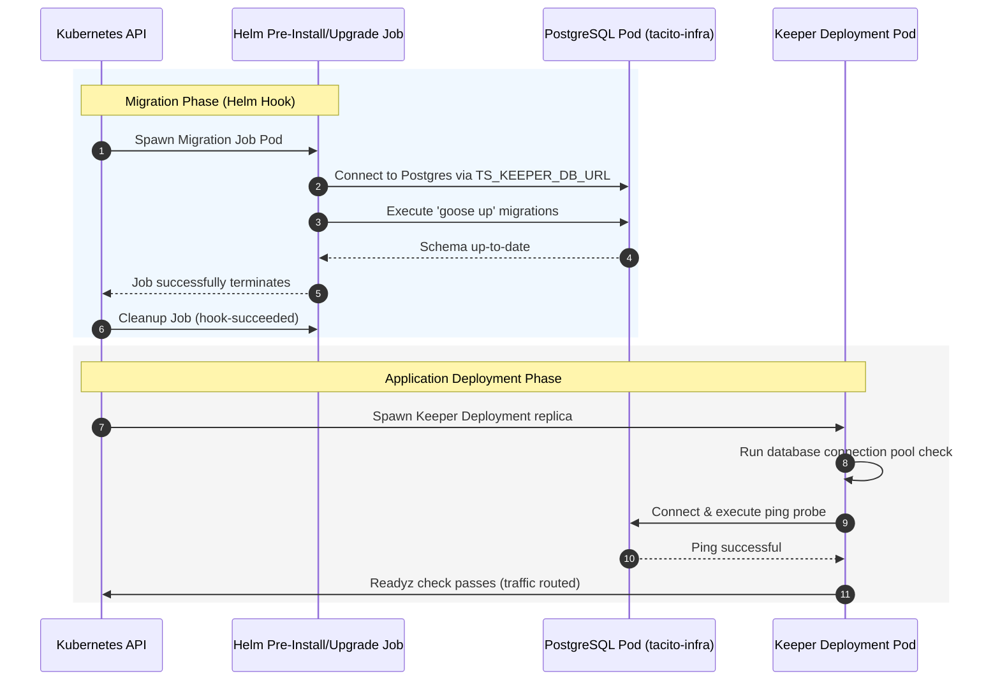

# SPEC-FR-M3.8: PostgreSQL Persistence & Migrations

| Field         | Value                                       |
|---------------|---------------------------------------------|
| ID            | SPEC-FR-M3.8                                |
| Status        | ACCEPTED                                    |
| Milestone     | M3                                          |
| Component     | keeper                                      |
| Depends On    | SPEC-FR-M3.1, SPEC-FR-M3.2, SPEC-FR-M3.3, SPEC-FR-M3.4, SPEC-FR-M3.5, SPEC-FR-M3.6, SPEC-FR-M3.7 |
| Supersedes    | none                                        |

---

## Context

Tacito Square components, in particular the **Keeper** orchestrator, require high-performance, transaction-safe, and multi-tenant isolated durable persistence. Additionally, local development, CI validation, and production Helm-based Kubernetes deployments need a robust, automated database migration strategy.

This specification consolidates both the Go application database layer and the Kubernetes/Helm binding architecture, ensuring migrations execute safely before services start and connections are securely established and traced.

---

## Specification

### 1. Persistent Layer Architecture & Outbound Adapters
- The keeper persistence layer MUST utilize **pgx/v5** (`github.com/jackc/pgx/v5`) as the core database driver and connection pool orchestrator.
- High-level queries may leverage **GORM** (`gorm.io/gorm`) for structure/relational operations, but outbound repository adapters MUST expose transactional safety:
  - All database adapter methods MUST accept `context.Context` to propagate deadlines, cancellations, and parent trace contexts.
  - Transactions MUST wrap operations requiring relational multi-table safety (e.g. Agent status transitions and relational assignments).
- **Multi-Tenant Scoping**: All queries executing CRUD or assignment lookups MUST include strict tenant boundaries (`tenant_id = ?`) derived from the context. If a tenant attempts to lookup or mutate a resource belonging to another tenant, the adapter MUST return a "not found" error, which translates to a `404 Not Found` API response to prevent entity discovery.

### 2. Connection Pooling & Resiliency Defaults
- Connection pooling is managed via `pgxpool.Pool` inside the application bootstrapper.
- Pool options MUST support sensible configuration defaults:
  - `max_conns`: Default to `20` concurrent connections per replica.
  - `min_conns`: Default to `2` idle connections.
  - `max_conn_lifetime`: Default to `30m`.
  - `max_conn_idle_time`: Default to `5m`.
- The database connection string is passed via `TS_KEEPER_DB_URL` (or fallback `TS_DATABASE_URL` environment variables).

### 3. OpenTelemetry Database Client Query Tracing
- Database operations MUST emit structured trace spans correlated to the active request context.
- Every SQL query MUST trigger a child span named `db.query` implementing standard OpenTelemetry database semantic conventions:
  - `db.system`: `postgresql`
  - `db.statement`: The parsed/sanitized SQL statement being executed.
  - The tracer MUST inject the parent span context into database operations so GORM/pgx client spans are properly nested under the incoming REST API handler span.

### 4. Database Pool Status Metrics (Observability Integration)
- In compliance with the Prometheus metrics requirements of `SPEC-NFR-OBSERVABILITY`, the Keeper `/metrics` endpoint MUST expose active, real-time database connection pool state metrics.
- The following Prometheus metrics MUST be collected and exposed under the pgx connection pool:
  - `db_pool_acquired_connections` (Gauge): The number of active/acquired connections currently in use.
  - `db_pool_idle_connections` (Gauge): The number of currently idle/free connections in the pool.
  - `db_pool_total_connections` (Gauge): The total number of open connections currently in the pool.
  - `db_pool_max_connections` (Gauge): The maximum number of allowed connections in the pool (configured limit).
- These metrics MUST be registered via a custom Prometheus collector wrapping the active `pgxpool.Pool` connection statistics (`pool.Stat()`), executing dynamically on each scrape request.

### 5. Zero-Latency Bootstrapping & Readiness Probes
- **Deterministic Route Registration**: The Keeper HTTP server MUST unconditionally register all endpoints at boot time.
- **Graceful DB Availability Middleware**: 
  - Routes under `/api/v1` are guarded by a middleware that performs a fast pointer check on the database connection pool (`pool == nil`).
  - If the database was offline during bootstrap, incoming requests return a graceful `503 Service Unavailable` with `{"error": "Database service unavailable"}`, rather than crashing or hanging the router.
- **Readyz Integration**: The readyz probe (`/readyz`) MUST register a check that tests database connectivity. If the connection pool is down, the probe fails and returns a `503 Service Unavailable` status `not_ready`, preventing Kubernetes from routing user traffic to unready pods.

---

## Helm Deployment & Migration Bindings

In Kubernetes deployments, database schema migrations and persistent state connectivity are tightly bound using Helm templates and secrets.



### 1. Connection & Persistence Binding
- **Secret Management**: Database passwords and URI connection strings MUST be stored inside a secure Kubernetes Secret, structured as:
  ```yaml
  apiVersion: v1
  kind: Secret
  metadata:
    name: {{ include "tacito-square.fullname" . }}-keeper-db
  type: Opaque
  data:
    password: {{ .Values.keeper.config.db.password | b64enc | quote }}
  ```
- **Environment Mapping**: The Keeper container in the Deployment spec binds environment variables from this secret:
  ```yaml
  env:
    - name: TS_KEEPER_DB_URL
      value: {{ .Values.keeper.config.db.url | quote }}
    - name: TS_KEEPER_DB_PASSWORD
      valueFrom:
        secretKeyRef:
          name: {{ include "tacito-square.fullname" . }}-keeper-db
          key: password
  ```

### 2. Pre-Deployment Database Migration Hook (Job Pattern)
To ensure the PostgreSQL database schema is fully migrated before any new application pod starts, the Helm chart MUST execute migrations via a Kubernetes **Job** utilizing **Helm Hooks**.

- **Job Template** (`templates/keeper/migration-job.yaml`):
  ```yaml
  apiVersion: batch/v1
  kind: Job
  metadata:
    name: {{ include "tacito-square.fullname" . }}-keeper-migrate
    labels:
      {{- include "tacito-square.labels" (dict "component" "keeper-migrate" "context" .) | nindent 6 }}
    annotations:
      "helm.sh/hook": pre-install,pre-upgrade
      "helm.sh/hook-weight": "5"
      "helm.sh/hook-delete-policy": before-hook-creation,hook-succeeded
  spec:
    template:
      metadata:
        name: {{ include "tacito-square.fullname" . }}-keeper-migrate
      spec:
        restartPolicy: OnFailure
        containers:
          - name: migrate
            image: {{ include "tacito-square.image" (dict "registry" .Values.keeper.image.registry "name" "tacito-square/keeper" "tag" .Values.keeper.image.tag "global" .Values.global) }}
            command: ["/app/keeper", "migrate", "up"]  # Executes Goose migration logic packaged in the image
            env:
              - name: TS_KEEPER_DB_URL
                value: {{ .Values.keeper.config.db.url | quote }}
              - name: TS_KEEPER_DB_PASSWORD
                valueFrom:
                  secretKeyRef:
                    name: {{ include "tacito-square.fullname" . }}-keeper-db
                    key: password
  ```

- **Alternative (Init Container Pattern)**:
  If a dedicated Helm Hook job is not desired, the chart MAY optionally bind migrations inside an `initContainer` inside the Keeper Deployment pod:
  ```yaml
  initContainers:
    - name: wait-and-migrate
      image: goose/goose:v3.18.0
      command: ["goose", "-dir", "/migrations", "postgres", "$(TS_KEEPER_DB_URL)", "up"]
      env:
        - name: TS_KEEPER_DB_URL
          value: {{ .Values.keeper.config.db.url | quote }}
  ```
  *The Job Pattern (Helm Hook) is the recommended standard because it isolates cluster admin permissions and keeps application pod startup times minimal.*

---

## Acceptance Criteria

1. **Transactional Invariant Consistency**: GORM transaction adapters cleanly rollback database changes on error during multi-stage assignments.
2. **Deterministic Route Initialization**: Keeper boots up and registers all HTTP endpoints successfully even if the database is unconfigured or unreachable.
3. **Graceful Error Middleware Propagation**: Endpoints return a structured `503 Service Unavailable` with `{"error": "Database service unavailable"}` when the postgres pool is offline.
4. **Active Correlation Spans**: All database client calls generate OpenTelemetry trace spans correlated to the active parent HTTP request `trace_id`.
5. **Pre-install Migration Hook**: Database migrations execute cleanly via a Helm `pre-install`/`pre-upgrade` Job before keeper pods are spawned in the cluster.
6. **Connection Encryption**: TLS is enforced for database connections by appending `sslmode=require` or similar parameters in Helm configuration blocks.
7. **Database Pool Metrics Exposition**: The `/metrics` endpoint exposes `db_pool_acquired_connections`, `db_pool_idle_connections`, `db_pool_total_connections`, and `db_pool_max_connections` gauged metrics correctly registered under a custom Prometheus collector.

---

## Test Plan

### 1. Isolated Repository Integration Tests (Testcontainers)
- Run isolated tests with real PostgreSQL instances using build tags:
  ```bash
  go test -v -tags=integration ./internal/keeper/adapters/postgres/...
  ```
- Assert that migrations parse successfully, GORM mappings bind perfectly, and concurrent GORM queries perform without deadlocks.

### 2. HTTP Routing and Failure Probes
- Run HTTP handler unit tests asserting database middleware gracefully intercepts unavailable connection pools.
- Verify `/readyz` responds with `503 Service Unavailable` and status `not_ready` when pool is `nil`.

### 3. Helm Template & Dry-Run Validation
- Validate the Helm configuration by rendering and linting templates:
  ```bash
  helm lint tools/helm/tacito-square/
  helm template tools/helm/tacito-square/ --dry-run
  ```
- Assert that `pre-install` hooks and DB secret binds render valid Kubernetes resources with proper label conventions.

### 4. Database Pool Status Metrics
- Write unit tests asserting that the custom Prometheus collector registers cleanly under nil and active pool states without panicking.
- Verify that scraping `/metrics` contains the `db_pool_` gauged statistics.

---

## Files Affected

- `internal/keeper/adapters/postgres/agent_repository.go` (Persistence adapter implementation)
- `internal/keeper/bootstrap.go` (Deterministic route registration & DB middleware wiring)
- `internal/keeper/adapters/http/middleware.go` (Availability check logic)
- `internal/shared/observability/metrics.go` (Prometheus database pool collector registration)
- `tools/helm/tacito-square/templates/keeper/deployment.yaml` (Keeper environment mapping)
- `tools/helm/tacito-square/templates/keeper/secret-db.yaml` (Secret bindings)
- `tools/helm/tacito-square/templates/keeper/migration-job.yaml` (Helm Hook job)
