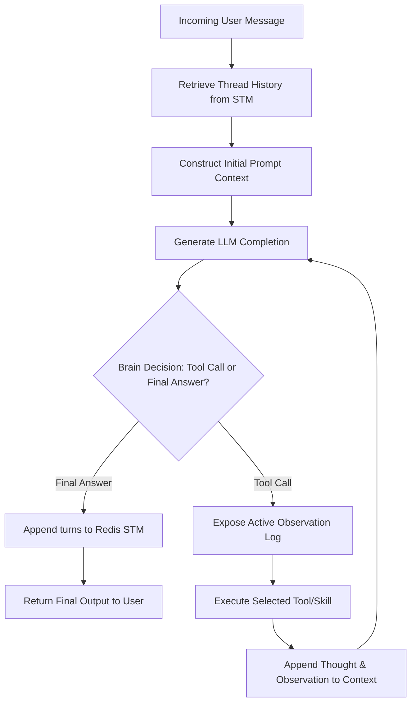

# SPEC-FR-M5.10: Agent Cognitive Architecture & Reasoning Loop

| Field         | Value                                       |
|---------------|---------------------------------------------|
| ID            | SPEC-FR-M5.10                               |
| Status        | VERIFIED                                    |
| Milestone     | M5                                          |
| Component     | agent                                       |
| Depends On    | SPEC-FR-M5.2, SPEC-FR-M5.3, SPEC-FR-M5.4, SPEC-FR-M5.5 |
| Supersedes    | none                                        |

## Context

Current agent specifications (SPEC-FR-M5.2, SPEC-FR-M5.3, SPEC-FR-M5.4) outline a linear, passive execution pipeline where short-term memory (STM) is retrieved and long-term memory (LTM) is automatically queried (passive RAG) *before* the LLM reasoning step. 

This model has several performance and reasoning drawbacks:
1. **Inefficiency:** Simple conversational queries generate unnecessary embeddings and vector searches, increasing latency and API costs.
2. **Context Pollution:** Passive vector retrieval injects semantically similar but contextually irrelevant information into the prompt, diluting the LLM's focus.
3. **Static Skillset:** Tools from all assigned skill collections are statically loaded at once, leading to tool-congestion and degradation in LLM planning accuracy.

To resolve this, this specification introduces an **Active, Agentic Reasoning Loop (Cognitive Architecture)**. The linear pipeline is replaced with an iterative loop (Thought-Action-Observation) where the brain dynamically decides when to recall long-term memories and which skills/tools to activate based on prompt-driven decisions.

---

## Specification

### 1. The Active Reasoning Loop (Cognitive Engine)
* **ReAct Pattern:** The system MUST implement an iterative reasoning loop inside `internal/agent/application/service/cognitive_engine.go` (orchestrated by `MessageProcessor`).
* **Loop State:** For a single user request, the engine maintains an ephemeral execution trace containing:
  - System Prompt
  - Active Thread History (retrieved from Redis STM)
  - Current User Query
  - Thought/Action/Observation history of the active loop execution
* **Loop Constraints:**
  - The loop MUST execute up to a configurable maximum step limit (`TS_AGENT_MAX_REASONING_STEPS`, defaulting to `5`).
  - If the step limit is exceeded without yielding a final answer, the engine MUST terminate and return the best available response, logged with a structured warning.
  - The engine MUST terminate the loop immediately when the LLM returns a final text response instead of a tool invocation.



### 2. LTM Search as a Brain Decision (Active Recall)
* **Removal of Passive RAG:** The agent MUST NOT automatically generate embeddings or search Qdrant upon receiving a user message.
* **Recall Memory Tool:** The engine MUST register a built-in cognitive tool called `recall_memory` to the LLM's tool definition.
* **Tool Schema:**
  - Name: `recall_memory`
  - Parameters:
    - `query` (string, required): The target semantic search string.
    - `limit` (integer, optional): Maximum matching entries to return (default `3`).
    - `category` (string, optional): Restrict search to specific LTM entry types (`conversation`, `document`, `fact`, `procedural`).
* **Tool Execution:** 
  - Under the hood, this tool invokes the outbound `Embedder` and `LongTermMemory` ports.
  - The Qdrant search MUST strictly apply the tenant-isolation and community-sharing filters defined in SPEC-FR-M5.4.
  - The search results are returned to the LLM as the tool's `Observation`.

### 3. Dynamic Skill Loading as a Brain Decision
* **Mitigating Tool Congestion:** To prevent LLM degradation from excessive active tools, the agent MUST support dynamic tool registration during the reasoning loop.
* **Static Bounds:** The agent is initialized with a pool of allowed skill collections (resolved at deploy-time by keeper).
* **Dynamic Active Set:** By default, only a minimal base set of tools (e.g., `recall_memory`, `request_skill`) is exposed to the LLM.
* **Enable Skill Tool:** The engine MUST register a built-in cognitive tool called `enable_skill` to the LLM's tool definition.
* **Tool Schema:**
  - Name: `enable_skill`
  - Parameters:
    - `skill_name` (string, required): The name of the registered skill collection to activate.
* **Tool Execution:**
  - If the requested skill is in the agent's authorized pool, the engine activates the underlying MCP tools, adding them to the active tool definitions sent in subsequent LLM completion iterations.
  - If unauthorized, the tool returns an error observation: `"Skill unauthorized or not found."`

### 4. Structured Logging & Intermediate Reasoning Emission
* **Zerolog Structured Logging:** The system MUST log each reasoning step (Thought, Action/Tool Call, Observation, Step Index) to stdout in structured JSON format using `zerolog`. Log entries MUST include standard context fields: `tenant_id`, `agent_id`, `thread_id`, `trace_id`, `span_id`, and `reasoning_step_index`.
* **Asynchronous/Intermediate NATS Emission:** To provide answer consumers with real-time evidence of the brain's internal reasoning process, the agent MUST publish intermediate reasoning events asynchronously over NATS.
* **NATS Subject Schema:** Intermediate reasoning events MUST be published to the subject:
  `ts.tenant.{tenant_id}.agent.{agent_id}.thread.{thread_id}.reasoning`
* **Intermediate Message Payload:** The payload MUST be published using a non-final JSON schema containing:
  ```json
  {
    "step_index": 1,
    "thought": "The user is asking about database pooling. I need to recall the details from my long-term memory.",
    "action": {
      "tool": "recall_memory",
      "input": {
        "query": "database pooling config"
      }
    },
    "observation": "Returned 2 results...",
    "timestamp": "2026-06-01T01:15:00.000Z"
  }
  ```

### 5. Statelessness and Thread Integration
* **Redis Integration (STM):** The active reasoning loop state (intermediate thoughts and tool outputs) is ephemeral and exists only within the memory of the execution instance.
* **Persistence of Turns:** Once the final answer is generated, the final User turn and the final Assistant response are appended to Redis STM as a single pair of conversation turns, in accordance with SPEC-FR-M5.3. Intermediate reasoning thoughts and tool outputs are logged to the structured telemetry stream but NOT saved as raw conversation turns in Redis STM, keeping the thread history clean.

### 6. Resiliency & Graceful Degradation
* **OTel Integration:** Each step of the reasoning loop MUST be represented as a sub-span of the parent NATS message processing span. The engine MUST record each cognitive thought and tool invocation as an OpenTelemetry **Span Event** on the active span, attaching attributes for the step index and tool name. If a tool invocation or reasoning step encounters an error, the engine MUST record the exception on the active span (setting the span status to error) and attach the error description before initiating fallback logic.
* **Circuit Breakers:** All cognitive tools (`recall_memory`, MCP executions) MUST run inside the circuit breaker pattern defined in SPEC-FR-M5.2.
* **Fallback Behavior:** If `recall_memory` fails due to Qdrant/Embedder outages, the tool returns a standard JSON error block: `{"error": "Memory store temporarily unavailable."}`. The LLM must be instructed to degrade gracefully and answer using its internal parameters.


---

## Acceptance Criteria

1. **Active Loop Execution:**
   - The agent executes a multi-step reasoning flow, returning a final response only after completing necessary tool invocations.
   - The loop respects `TS_AGENT_MAX_REASONING_STEPS` and gracefully terminates if exceeded.
2. **LTM Boundary Enforcement:**
   - Vector database queries are executed *only* when the LLM invokes the `recall_memory` tool.
   - The Qdrant gRPC filter applied inside `recall_memory` enforces strict multi-tenant boundaries (rejecting requests if tenant ID is missing).
3. **Dynamic Skill/Tool Visibility:**
   - At start, the LLM is presented only with the base system tools (`recall_memory`, `enable_skill`).
   - Calling `enable_skill` dynamically exposes the requested MCP tools for all subsequent reasoning turns within that request context.
4. **Hexagonal Architecture Compliance:**
   - The loop logic and state representations reside strictly inside the domain/application layers. No adapter (e.g., Qdrant, Redis, Gin) details leak into `internal/agent/application/service/cognitive_engine.go`.
5. **Proper Logging and Intermediate Emission:**
   - For every tool/thought step, the agent outputs a structured JSON `zerolog` entry containing the reasoning trace.
   - The agent publishes intermediate step payloads over NATS to the designated reasoning subject before completing the user request with the final answer.


---

## Test Plan

### Automated Tests
1. **Unit Tests:**
   - Verify the `cognitive_engine` execution loop halts exactly when a final text response is received.
   - Verify the execution loop halts and logs a warning when `TS_AGENT_MAX_REASONING_STEPS` is exceeded.
   - Assert that intermediate tool executions are formatted correctly in the history context for subsequent LLM requests.
2. **Integration Tests:**
   - Use mock LLM providers that return structured tool calls.
   - Assert that invoking `recall_memory` successfully queries the mock long-term memory port.
   - Assert that invoking `enable_skill` correctly exposes additional mock tools to the mock LLM in the subsequent iteration.
   - Assert that Redis STM is updated with only the user input and the final assistant response.
   - Assert that intermediate reasoning events are published to NATS with correct step parameters and JSON schema structure.


### Manual Verification
1. Configure an agent with memory and a mock mathematical MCP server skill.
2. Send a query that requires memory recall (e.g., *"What did we discuss about database pooling last week?"*).
3. Monitor structured JSON logs (`zerolog`) to verify:
   - Initial LLM request executes with base tools.
   - The LLM outputs a tool call to `recall_memory`.
   - Qdrant queries execute successfully with correct tenant parameters.
   - The final output is returned and only the final turn is appended to Redis.

---

## Files Affected

- `[NEW] internal/agent/domain/model/reasoning.go` — Ephemeral reasoning loop state and cognitive tool schemas.
- `[NEW] internal/agent/application/service/cognitive_engine.go` — Iterative reasoning loop engine.
- `[MODIFY] internal/agent/application/service/message_processor.go` — Update orchestration to delegate message processing to the cognitive engine.
- `[MODIFY] specs/INDEX.md` — Register SPEC-FR-M5.10.
