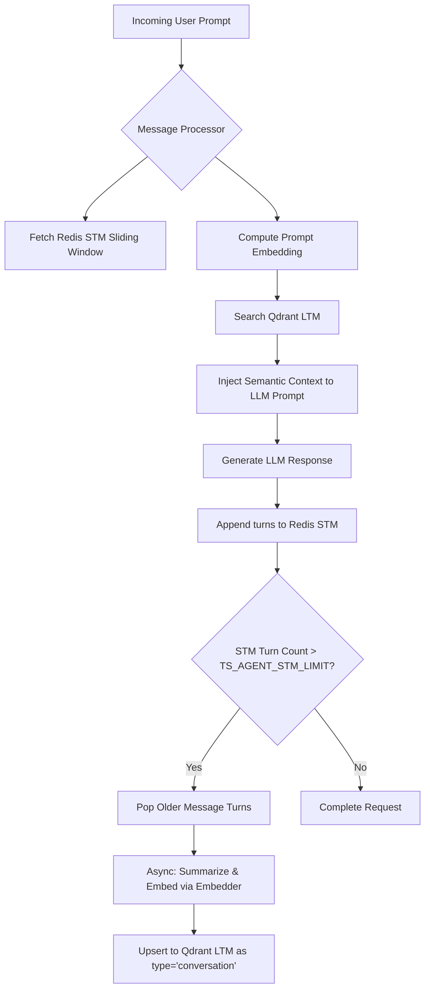

# SPEC-FR-M5.4: Long-Term Memory (Qdrant)

| Field         | Value                                       |
|---------------|---------------------------------------------|
| ID            | SPEC-FR-M5.4                                |
| Status        | IN_PROGRESS                                 |
| Milestone     | M5                                          |
| Component     | agent                                       |
| Depends On    | SPEC-FR-M5.1, SPEC-FR-M5.2, SPEC-FR-M5.3    |
| Supersedes    | none                                        |

## Context

Agents must scale horizontally and remain stateless between reasoning cycles, yet retain the ability to retrieve rich historical context, system facts, and document libraries. 
* **Short-Term Memory (Redis)** handles active conversation thread windows.
* **Long-Term Memory (Qdrant)** offloads dense vector embeddings for semantic, similarity-based retrieval across conversations and threads.

This specification defines the outbound `LongTermMemory` and `Embedder` ports, the Qdrant gRPC adapter implementation, strict multi-tenant and community-wide isolation filters, cognitive memory consolidation patterns, and integration with the inbound messaging pipeline.

---

## Specification

### 1. Domain Models
Define the following domain structures inside `internal/agent/domain/model/ltm.go` (or extended inside `internal/agent/domain/model/memory.go`) to represent long-term semantic records:

```go
package model

import (
	"errors"
	"time"
)

// LTMEntryType represents the class of semantic content stored in Long-Term Memory.
type LTMEntryType string

const (
	EntryTypeConversation LTMEntryType = "conversation" // Evicted STM turns, summaries of past threads
	EntryTypeDocument     LTMEntryType = "document"     // Chunked loaded documents (PDFs, Markdown, text)
	EntryTypeFact         LTMEntryType = "fact"         // Extracted declarations (user preferences, system settings)
	EntryTypeProcedural   LTMEntryType = "procedural"   // Successful plans, recipes, tool-sequence execution traces
)

// LTMEntry represents a single semantic memory stored as a dense vector with rich metadata.
type LTMEntry struct {
	ID        string            `json:"id"`                  // Unique UUID
	Content   string            `json:"content"`             // Raw text represented by the embedding
	Embedding []float32         `json:"embedding,omitempty"` // High-dimensional dense vector
	Type      LTMEntryType      `json:"type"`                // Type classification of the memory
	Source    string            `json:"source"`              // e.g. "eviction_consolidator", "pdf_uploader", "thought_loop"
	Timestamp time.Time         `json:"timestamp"`
	Metadata  map[string]string `json:"metadata,omitempty"`  // Extra metadata (e.g. document name, page number, user ID)
	Score     float32           `json:"score,omitempty"`     // Match relevance score (populated on search results)
}

// LTMFilter represents runtime constraints for querying long-term memories.
type LTMFilter struct {
	Types       []LTMEntryType `json:"types,omitempty"`        // Filter by specific memory types
	ThreadID    string         `json:"thread_id,omitempty"`    // Optional thread-specific scoping
	CommunityID string         `json:"community_id,omitempty"` // For community-wide sharing
	Visibility  string         `json:"visibility,omitempty"`   // "private", "community", or "tenant"
}

// Validate asserts standard long-term memory constraints.
func (e *LTMEntry) Validate() error {
	if e.ID == "" {
		return errors.New("memory id must not be empty")
	}
	if e.Content == "" {
		return errors.New("memory content must not be empty")
	}
	if len(e.Embedding) == 0 {
		return errors.New("memory embedding vector must not be empty")
	}
	switch e.Type {
	case EntryTypeConversation, EntryTypeDocument, EntryTypeFact, EntryTypeProcedural:
		// valid
	default:
		return errors.New("invalid long-term memory type: " + string(e.Type))
	}
	return nil
}
```

---

### 2. Hexagonal Ports & Domain Interfaces

#### A. Embedding Port (`internal/agent/application/ports/outbound/embedder.go`)
Decouple vector embedding creation from LLM chat generation. Define the `Embedder` interface:

```go
package outbound

import (
	"context"
)

type Embedder interface {
	// CreateEmbedding generates a high-dimensional dense vector for the given text.
	CreateEmbedding(ctx context.Context, text string) ([]float32, error)

	// CreateEmbeddingsBatch generates dense vectors for a slice of texts in parallel.
	CreateEmbeddingsBatch(ctx context.Context, texts []string) ([][]float32, error)
}
```

#### B. Long-Term Memory Port (`internal/agent/application/ports/outbound/ltm.go`)
Define the driving operations for semantic search and storage:

```go
package outbound

import (
	"context"
	"github.com/morphy76/tacito-square/internal/agent/domain/model"
)

type LongTermMemory interface {
	// Save stores semantic memory entries under a strictly tenant-isolated scope.
	Save(ctx context.Context, tenantID, agentID string, entries []model.LTMEntry) error

	// Search queries Qdrant for similar memories using the provided vector.
	Search(ctx context.Context, tenantID, agentID string, vector []float32, filter model.LTMFilter, limit int, threshold float32) ([]model.LTMEntry, error)

	// Delete removes memories matching specific filters.
	Delete(ctx context.Context, tenantID, agentID string, filter model.LTMFilter) error
}
```

---

### 3. Qdrant Infrastructure Adapter

Implement the `QdrantLTMAdapter` inside `internal/agent/adapters/outbound/qdrant/ltm_adapter.go` using the official `github.com/qdrant/go-client/grpc` library.

#### A. Shared Collection & Strict Multitenancy Routing
To avoid system degradation from collection indexing overhead, the adapter uses a shared collection format, configured via `TS_AGENT_QDRANT_COLLECTION_NAME` (defaulting to `ts_agent_memories`). 

To satisfy the strict multi-tenant isolation requirements of `RULE[cloud-first.md]`, every upsert and search MUST execute with mandatory payload tags and search filters.

#### B. Storage Payload Schema
Every point written to Qdrant contains:
* **Point ID**: Converted from the `LTMEntry.ID` UUID.
* **Vector**: Configurable dimension (e.g., 1536 for OpenAI `text-embedding-3-small` or 384 for standard local transformers).
* **Payload Fields**:
  ```json
  {
    "tenant_id": "string (strict boundary)",
    "agent_id": "string",
    "community_id": "string",
    "visibility": "string (private | community | tenant)",
    "type": "string (conversation | document | fact | procedural)",
    "thread_id": "string (optional)",
    "content": "string (raw text)",
    "source": "string",
    "timestamp": "string (RFC3339)"
  }
  ```

#### C. Strict Access Filter Strategy
To guarantee absolute tenant boundary enforcement and enable flexible agent communities (Principle P4):
* **Single Agent Private Memory Query**:
  ```text
  tenant_id == {TenantID} AND agent_id == {AgentID} AND visibility == "private"
  ```
* **Community Shared Memory Query**:
  ```text
  tenant_id == {TenantID} AND community_id == {CommunityID} AND visibility == "community"
  ```
* **Unified Permission Filter (Default search context)**:
  When an agent searches LTM, it must query all memories it is authorized to see:
  ```text
  tenant_id == {TenantID} AND (
    (agent_id == {AgentID} AND visibility == "private") OR
    (community_id == {CommunityID} AND visibility == "community") OR
    (visibility == "tenant")
  )
  ```

*Go gRPC Filter Construction Example:*
```go
import qdrant "github.com/qdrant/go-client/grpc"

func buildSearchFilter(tenantID, agentID, communityID string, filter model.LTMFilter) *qdrant.Filter {
    // 1. Mandatory Tenant ID Filter
    tenantCondition := &qdrant.Condition{
        Condition: &qdrant.Condition_Field{
            Field: &qdrant.FieldCondition{
                Key: "tenant_id",
                Match: &qdrant.Match{
                    MatchValue: &qdrant.Match_Text{Text: tenantID},
                },
            },
        },
    }

    // 2. Scoped Visibility Conditions
    var visibilityConditions []*qdrant.Condition

    // Private condition
    privateCond := &qdrant.Condition{
        Condition: &qdrant.Condition_Filter{
            Filter: &qdrant.Filter{
                Must: []*qdrant.Condition{
                    {Condition: &qdrant.Condition_Field{Field: &qdrant.FieldCondition{Key: "agent_id", Match: &qdrant.Match{MatchValue: &qdrant.Match_Text{Text: agentID}}}}},
                    {Condition: &qdrant.Condition_Field{Field: &qdrant.FieldCondition{Key: "visibility", Match: &qdrant.Match{MatchValue: &qdrant.Match_Text{Text: "private"}}}}},
                },
            },
        },
    }
    visibilityConditions = append(visibilityConditions, privateCond)

    // Community condition
    if communityID != "" {
        communityCond := &qdrant.Condition{
            Condition: &qdrant.Condition_Filter{
                Filter: &qdrant.Filter{
                    Must: []*qdrant.Condition{
                        {Condition: &qdrant.Condition_Field{Field: &qdrant.FieldCondition{Key: "community_id", Match: &qdrant.Match{MatchValue: &qdrant.Match_Text{Text: communityID}}}}},
                        {Condition: &qdrant.Condition_Field{Field: &qdrant.FieldCondition{Key: "visibility", Match: &qdrant.Match{MatchValue: &qdrant.Match_Text{Text: "community"}}}}},
                    },
                },
            },
        },
        visibilityConditions = append(visibilityConditions, communityCond)
    }

    // Tenant condition
    tenantSharedCond := &qdrant.Condition{
        Condition: &qdrant.Condition_Field{
            Field: &qdrant.FieldCondition{
                Key: "visibility",
                Match: &qdrant.Match{
                    MatchValue: &qdrant.Match_Text{Text: "tenant"},
                },
            },
        },
    }
    visibilityConditions = append(visibilityConditions, tenantSharedCond)

    // Combine conditions
    return &qdrant.Filter{
        Must: []*qdrant.Condition{tenantCondition},
        Should: visibilityConditions,
    }
}
```

---

### 4. Memory Consolidation & Eviction Pipelines

To manage the cognitive state of the agent dynamically without manual intervention, two automated processing pipelines are established:



#### A. Active Retrieval (RAG Pipeline)
1. Message ingestion parses `tenant_id`, `agent_id`, `community_id`, and `thread_id`.
2. Generate an embedding vector of the incoming query using the `Embedder` outbound port.
3. Query Qdrant with similarity search, using the generated vector and the permission filters.
4. Retrieve the top $K$ results matching score thresholds (e.g. `score >= 0.7`).
5. Format matches and inject them as system context blocks (`<long_term_memory>`) inside the reasoning prompt alongside standard Redis Short-Term History.

#### B. Passive Memory Consolidation (Eviction & Synthesis)
* **STM Turn Eviction**: When a write to Redis causes the list size to exceed the sliding window limit (`TS_AGENT_STM_LIMIT`), the oldest `user/assistant` message turns are popped from Redis.
* **Semantic Compression**: The popped turns are sent to a background worker. The worker triggers a fast summarization prompt to condense the conversation's core facts and context.
* **LTM Ingestion**: The summarized block is embedded and stored in Qdrant as `type: "conversation"`, preserving long-term semantic context.

---

### 5. Resiliency & Graceful Degradation
* **Failure isolation**: In alignment with `RULE[cloud-first.md]`, if Qdrant or the Embedder returns an error, the agent MUST NOT crash or fail the request.
* **Degraded Fallback**: The agent logs a structured JSON warning (`zerolog`) detailing the outage, skips the LTM context block, and falls back to using only the active Redis short-term memory (acting statelessly as a fallback behavior).
* **Circuit Breakers**: Outbound connections to Qdrant and the Embedder are wrapped in independent `resiliency.CircuitBreaker` instances.

---

## Acceptance Criteria

1. **Strict Multi-Tenant Separation**:
   * Vectors created under tenant `T1` must never be returned in similarity search queries executed under tenant `T2`.
   * Search requests without a valid `tenant_id` must immediately reject processing.
2. **Community Sharing Scopes**:
   * An agent in community `C1` must successfully retrieve memories marked `visibility = "community"` shared by other agents in `C1`.
   * An agent in community `C1` must be blocked from retrieving memories marked `visibility = "community"` belonging to community `C2`, even under the same tenant.
3. **Resilient Outage Handling**:
   * Artificially severing the Qdrant connection during active conversation processing must result in the agent successfully completing its reasoning cycle, logging a Zerolog `WARN` message, and continuing with STM context.
4. **Cognitive Eviction Triggering**:
   * Setting `TS_AGENT_STM_LIMIT=3` must trigger active memory consolidation of the older turns on the 4th turn, generating a new Qdrant vector point with `type = "conversation"`.
5. **Observability Trace Integration**:
   * OpenTelemetry spans must capture the search latency, vector search parameters, and query results. Standard `GET /metrics` must expose outbound Qdrant gRPC connection latencies.

---

## Test Plan

### Automated Tests
1. **Unit Tests**:
   * Assert Qdrant gRPC filter construction correctly maps nested permissions for private, community, and tenant visibility rules.
   * Validate JSON serialization of different `LTMEntry` types (`conversation`, `document`, `fact`, `procedural`).
2. **Integration Tests (`testcontainers-go`)**:
   * Utilize `testcontainers-go` to run a temporary `qdrant/qdrant` container.
   * Execute integration test suites validating:
     * High-speed upsert of multiple embedding vectors.
     * Score threshold filtering (assert points below threshold are discarded).
     * Rigorous multi-tenant filtering (assert query returns zero points from another tenant).
     * Community scoping rules (assert correct visibility cross-filtering).
3. **Contract / Readiness Probes**:
   * Verify Qdrant TCP port connectivity check is running inside the parallel `/readyz` probe logic for the Agent component.

---

## Files Affected

- `[NEW] internal/agent/domain/model/ltm.go` — LTM structures, filters, and validation.
- `[NEW] internal/agent/application/ports/outbound/embedder.go` — Outbound text-embedding interface.
- `[NEW] internal/agent/application/ports/outbound/ltm.go` — Outbound vector storage interface.
- `[NEW] internal/agent/adapters/outbound/qdrant/ltm_adapter.go` — Qdrant gRPC implementation.
- `[MODIFY] internal/agent/application/service/message_processor.go` — Integrate LTM retrieval and async memory consolidation.
- `[MODIFY] specs/INDEX.md` — transition status.
