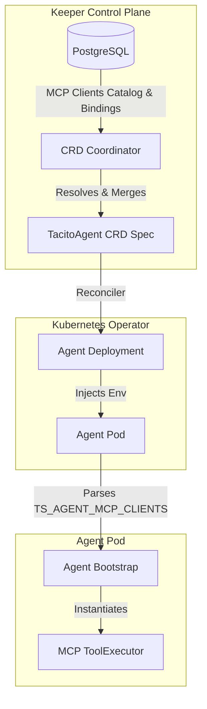

# SPEC-FR-M5.5: Tool Invocation (MCP)

| Field         | Value                                       |
|---------------|---------------------------------------------|
| ID            | SPEC-FR-M5.5                                |
| Status        | ACCEPTED                                    |
| Milestone     | M5                                          |
| Component     | agent, keeper, operator                     |
| Depends On    | SPEC-FR-M5.2, SPEC-FR-M5.10                 |
| Supersedes    | none                                        |

## Context

Agents execute computational, interactive, or integration tasks (such as math, database queries, and external API requests) by communicating with Model Context Protocol (MCP) clients. To maintain strict architectural decoupling, the agent core binary does not contain hardcoded domain-specific tools (per `BUG-M5.4`). Instead, all external capabilities are delegated to decoupled MCP configurations.

This specification details the contract and implementation for registering, propagating, and dynamically executing tools via MCP clients in a secure, multitenant, and resilient manner.

---

## Specification

### 1. Hexagonal Ports & Domain Models

To isolate the agent's core cognitive engine from concrete transport protocols and third-party MCP SDK implementations, we define the outbound port `ToolExecutor` and its supporting domain models.

*   **Outbound Port:** Define the `ToolExecutor` port inside `internal/agent/application/ports/outbound/tool_executor.go`:
    ```go
    package outbound

    import (
        "context"
    )

    // MCPClientInfo defines the configuration details for a single target MCP connection.
    type MCPClientInfo struct {
        Name         string            `json:"name"`
        Transport    string            `json:"transport"` // "stdio" or "sse"
        Command      string            `json:"command,omitempty"`
        Args         []string          `json:"args,omitempty"`
        Env          map[string]string `json:"env,omitempty"`
        URL          string            `json:"url,omitempty"`
        AllowedTools []string          `json:"allowed_tools"`
    }

    // ToolDefinition represents a single allowed tool metadata block exposed to the LLM.
    type ToolDefinition struct {
        Name        string         `json:"name"`
        Description string         `json:"description"`
        InputSchema map[string]any `json:"input_schema"` // JSON Schema of parameters
    }

    // ToolExecutor abstracts the execution and management of MCP tools.
    type ToolExecutor interface {
        // ListAllowedTools returns the consolidated list of all whitelisted tools across all configured MCP clients.
        ListAllowedTools(ctx context.Context) ([]ToolDefinition, error)

        // Execute routes and runs a whitelisted tool with the given arguments.
        Execute(ctx context.Context, toolName string, arguments map[string]any) (string, error)

        // Close cleans up all active subprocesses and SSE HTTP connections.
        Close(ctx context.Context) error
    }
    ```

---

### 2. Keeper-Operator-Agent Propagation Contract

To propagate MCP configurations from the control plane to stateless agent pods without introducing runtime database couplings, we implement a structured propagation pipeline:



#### A. Keeper CRD Coordinator (`internal/keeper/adapters/outbound/crd/`)
*   When submitting the agent configuration via `SubmitAgentCRD`, the coordinator:
    1.  Iterates through the agent's assigned `MCPClients` (loaded from the `agents` table).
    2.  Resolves each `ServerID` against the `mcp_servers` database catalog (now logically treated as base MCP Client configurations).
    3.  Merges the base catalog properties (`command`, `args`, `env`, `transport`, `url`) with the agent's specific overrides (`CustomEnv`, `CustomArgs`, and `AllowedTools`).
    4.  Populates the `MCPClients` field inside the K8s custom resource spec.
*   **CRD Schema Extension:** Add `MCPClients` to `v1alpha1.TacitoAgentSpec`:
    ```go
    type MCPClientSpec struct {
        Name         string            `json:"name"`
        Transport    string            `json:"transport"`
        Command      string            `json:"command,omitempty"`
        Args         []string          `json:"args,omitempty"`
        Env          map[string]string `json:"env,omitempty"`
        URL          string            `json:"url,omitempty"`
        AllowedTools []string          `json:"allowedTools"`
    }
    ```

#### B. Kubernetes Operator (`internal/operator/`)
*   The operator reconciler reads `Spec.MCPClients` from the custom resource.
*   In `BuildDeployment`, the operator serializes the list of `MCPClientSpec` objects as a structured JSON string and injects it as a single environment variable:
    -   **Key:** `TS_AGENT_MCP_CLIENTS`
    -   **Format:** A JSON array of serialized client specifications.

#### C. Agent Pod Bootstrap (`internal/agent/`)
*   At startup, the agent bootstrap parses `TS_AGENT_MCP_CLIENTS`.
*   If the variable is missing or empty, the agent instantiates a no-op `ToolExecutor` (zero tools exposed).
*   For each configuration entry, the concrete `mcp` adapter instantiates an MCP client using the approved Go SDK:
    -   `stdio` transport: Launches the command as a local subprocess bound to the agent process lifetime.
    -   `sse` transport: Prepares an HTTP client targeting the SSE gateway URL.

#### D. Standalone Developer Helm Chart (`tools/helm/tacito-agent/`)
*   To enable offline development, local debugging, and integration testing without running the keeper and operator control plane, the standalone developer Helm chart MUST support registering MCP clients:
    -   `values.yaml` will declare a configurable `mcpClients` array representing the mock or developer MCP client configurations.
    -   `templates/deployment.yaml` will serialize this array into a structured JSON string and inject it as the `TS_AGENT_MCP_CLIENTS` environment variable inside the agent container.
    -   This guarantees that the standalone pod executes tool loops with environment variables identical to those generated by the operator at runtime.

---

### 3. Strict Execution & Whitelist Filtering

To prevent security violations and tool congestion (per `SPEC-FR-M5.10`), the agent MUST enforce a strict whitelist matching strategy:

1.  **Exempt Built-in Tools:** Base cognitive loop tools registered directly by the engine (`enable_skill`, `recall_memory`) are built-in infrastructural features and are **exempt** from environment-driven MCP whitelisting.
2.  **Tool Whitelist Filter:** For all external tools:
    *   During initialization, the MCP client queries the external MCP server (using `listTools` discovery) to retrieve the available schema definitions.
    *   The client **filters** the discovered tools: ONLY tools whose names are explicitly listed in the client's `allowed_tools` array are registered in the agent's active registry.
    *   If `allowed_tools` is empty, it acts as a secure **deny-all default**—no tools are exposed from that client.
3.  **LLM Visibility:** The active registry is supplied to the LLM during the cognitive loop's completion requests. Any tool call targeting an unlisted or unauthorized tool is rejected immediately with an observation error: `Error: tool [name] is not registered or allowed.`

---

### 4. Outbound Resiliency & Lifecycles

In accordance with `RULE[cloud-first.md]`, all external MCP client interactions must remain isolated and resilient:

*   **Explicit Timeouts:** Every outbound request made to an MCP client (such as tool execution or schema retrieval) must execute with an explicit, configurable timeout:
    -   **Key:** `TS_AGENT_MCP_TIMEOUT_SECONDS` (defaults to `10`).
    -   The timeout deadline must be actively propagated using Go's `context.Context`.
*   **Circuit Breakers:** All tool executions must be wrapped in a dedicated, state-machine-based circuit breaker (per `SPEC-FR-M5.2` standard). 
    -   **Trip Threshold:** Defaults to `5` consecutive failures.
    -   **Recovery Timeout:** Defaults to `15` seconds.
    -   If the circuit is open, the tool call returns a graceful degradation JSON block: `{"error": "Tool provider temporarily unavailable."}`.
*   **Subprocess Lifetime Management:**
    -   For `stdio` transports, spawned subprocesses must be initiated using `exec.CommandContext` using the application's root context.
    -   Upon receiving termination signals (`SIGTERM`, `SIGINT`), the agent's bootstrap invokes `ToolExecutor.Close()`, which terminates all spawned processes cleanly.
    -   Because stdio processes communicate over local streams (stdin/stdout) inside the container, horizontal scaling naturally scales subprocesses per pod replica, eliminating cluster-wide state leakage.

---

### 5. Telemetry & Observability

*   **OTel Tracing:** Each tool execution must be wrapped in a nested span. Spans must include:
    -   Span Name: `mcp.execute`
    -   Attributes: `mcp.client_name`, `mcp.tool_name`, `mcp.transport_type`, `tenant_id`, `agent_id`.
*   **JSON Structured Logs:** Standardize logging of tool calls using `zerolog`. Log entries must output in raw JSON format to stdout, correlating `trace_id`, `span_id`, and `reasoning_step_index`.
*   **Prometheus Metrics:** Expose the following metrics under `GET /metrics`:
    -   `ts_agent_mcp_requests_total`: Counter tracks total tool requests, partitioned by `mcp_client`, `tool_name`, and `status` (`success`, `error`).
    -   `ts_agent_mcp_request_duration_seconds`: Histogram records latency of tool executions.

---

## Acceptance Criteria

1.  **Strict Whitelisting:**
    *   If an MCP client configuration has `allowed_tools = ["math_add"]`, only the `math_add` tool is exposed to the LLM, even if the underlying MCP server exposes additional tools.
    *   If `allowed_tools` is empty, no tools from that client are registered.
2.  **Stateless Env Bootstrap:**
    *   The agent successfully boots and configures its tools strictly by parsing `TS_AGENT_MCP_CLIENTS` from the environment.
3.  **Resiliency Enforcement:**
    *   Tool calls that hang longer than `TS_AGENT_MCP_TIMEOUT_SECONDS` are aborted, returning a timeout error observation.
    *   Five consecutive failures to a client trips the circuit breaker, returning a fallback error block immediately on subsequent calls.
4.  **No Mock Tools:**
    *   No hardcoded procedural or mock programmatic tool handlers reside in the agent core binary (per `BUG-M5.4`).

---

## Test Plan

### Automated Tests
1.  **Unit Tests:**
    *   Verify parsing of `TS_AGENT_MCP_CLIENTS` JSON configurations.
    *   Validate the whitelisting filter logic: given a list of discovered tools, ensure only whitelisted tools are returned.
    *   Test circuit breaker transitions and timeout cancellation on mock MCP clients.
2.  **Integration Tests:**
    *   Use a mock `stdio` subprocess that behaves as an MCP server. Verify the MCP client spawns the process, executes commands, parses structured output, and terminates the subprocess cleanly on shutdown.

### Manual Verification
1.  Verify the operator creates a deployment with `TS_AGENT_MCP_CLIENTS` correctly populated from the `TacitoAgent` CRD spec.
2.  Inspect JSON output from `go test` and verify that no zombie processes remain active on the host machine.

---

## Files Affected

- `[MODIFY] specs/INDEX.md` — Promote `SPEC-FR-M5.5` status to `ACCEPTED`.
- `[MODIFY] pkg/kubernetes/apis/tacito/v1alpha1/tacitoagent_types.go` — Add `MCPClients` specification to `TacitoAgentSpec`.
- `[MODIFY] internal/keeper/adapters/outbound/crd/crd_coordinator.go` — Resolve MCP server records and populate `MCPClients` in CRD submit.
- `[MODIFY] internal/operator/application/service/reconcile_service.go` — Serialize and inject `TS_AGENT_MCP_CLIENTS` env var.
- `[NEW] internal/agent/application/ports/outbound/tool_executor.go` — Outbound port interface.
- `[NEW] internal/agent/adapters/outbound/mcp/mcp_adapter.go` — Concrete MCP client integration using approved Go SDK.
- `[MODIFY] internal/agent/application/service/cognitive_engine.go` — Load external tools from `ToolExecutor` port during reasoning steps.
- `[MODIFY] tools/helm/tacito-agent/values.yaml` — Add developer configurations for MCP clients.
- `[MODIFY] tools/helm/tacito-agent/templates/deployment.yaml` — Bind `TS_AGENT_MCP_CLIENTS` JSON-serialized environment variable.
