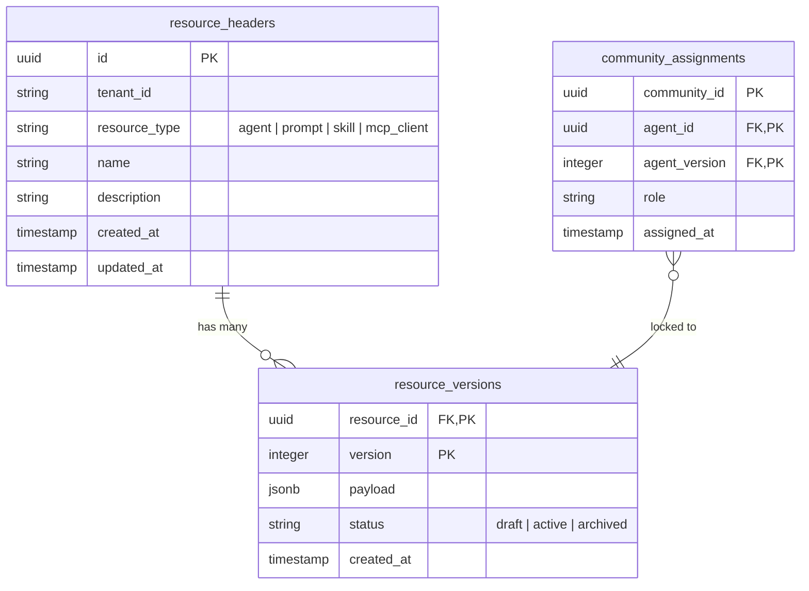

# SPEC-FR-M6.5.14: Agent & Supporting Resource Versioning, Portability API

| Field         | Value                                       |
|---------------|---------------------------------------------|
| ID            | SPEC-FR-M6.5.14                             |
| Status        | DRAFT                                       |
| Milestone     | M6.5                                        |
| Component     | shared, keeper, operator                    |
| Depends On    | SPEC-FR-M6.5.6, SPEC-FR-M6.5.11             |
| Supersedes    | none                                        |

## Context

Currently, configurations in the Keeper database (Agents, PromptTemplates, Skills, MCPClients) are stored in separate, mutable tables. When an asset is updated, it immediately overrides the previous content. This introduces:
1. **Stability Risks**: A prompt template update or skill adjustment can immediately disrupt active community agent workflows.
2. **Boilerplate Redundancy**: Creating individual versioning pipelines (tables, migrations, database queries, and repository code) for every model increases the maintenance load.

To resolve this, this specification defines a **Reusable, Decoupled Resource Versioning Software Design** (Unified Registry Pattern) that:
- Decouples static resource identity (Header/Metadata) from mutable snapshots (Version/Content).
- Standardizes the data store and repository code using a unified schema with JSONB payloads.
- Restructures Community Assignments to pin configurations to specific agent versions.

---

## Technical Design: Unified Resource Registry

Rather than creating separate `x_headers` and `x_versions` tables for each of the four resources, the system implements a unified **Resource & Version Store**. 



### 1. Database Schema (`deploy/postgres/migrations/`)

Create the unified tables to store all versioned configurations:

```sql
CREATE TABLE IF NOT EXISTS resource_headers (
    id UUID PRIMARY KEY,
    tenant_id VARCHAR(255) NOT NULL,
    resource_type VARCHAR(50) NOT NULL, -- 'agent', 'prompt', 'skill', 'mcp_client'
    name VARCHAR(255) NOT NULL,
    description TEXT,
    created_at TIMESTAMP WITH TIME ZONE NOT NULL,
    updated_at TIMESTAMP WITH TIME ZONE NOT NULL,
    CONSTRAINT unique_tenant_resource_name UNIQUE (tenant_id, resource_type, name)
);
CREATE INDEX IF NOT EXISTS idx_resources_tenant_type ON resource_headers(tenant_id, resource_type);

CREATE TABLE IF NOT EXISTS resource_versions (
    resource_id UUID REFERENCES resource_headers(id) ON DELETE CASCADE,
    version INTEGER NOT NULL,
    payload JSONB NOT NULL, -- Full typed content serialized to JSON (e.g. BrainConfig, content string, args)
    status VARCHAR(50) NOT NULL DEFAULT 'active',
    created_at TIMESTAMP WITH TIME ZONE NOT NULL,
    PRIMARY KEY (resource_id, version)
);
```

### 2. Reusable Domain Models (`internal/keeper/domain/model/`)

Define generic wrapper structures in Go to allow unified representation:

```go
package model

import (
	"time"
	"github.com/google/uuid"
)

type ResourceType string

const (
	ResourceTypeAgent        ResourceType = "agent"
	ResourceTypePrompt       ResourceType = "prompt"
	ResourceTypeSkill        ResourceType = "skill"
	ResourceTypeMCPClient    ResourceType = "mcp_client"
)

// ResourceHeader holds the permanent identity of a configuration resource.
type ResourceHeader struct {
	ID           uuid.UUID    `json:"id"`
	TenantID     string       `json:"tenant_id"`
	ResourceType ResourceType `json:"resource_type"`
	Name         string       `json:"name"`
	Description  string       `json:"description,omitempty"`
	CreatedAt    time.Time    `json:"created_at"`
	UpdatedAt    time.Time    `json:"updated_at"`
}

// ResourceVersion holds the immutable content of a specific version snapshot.
type ResourceVersion struct {
	ResourceID uuid.UUID `json:"resource_id"`
	Version    int       `json:"version"` // Sequentially incremented
	Payload    []byte    `json:"payload"` // Raw JSON representation of specific configuration
	Status     string    `json:"status"`  // "draft", "active", "archived"
	CreatedAt  time.Time `json:"created_at"`
}
```

### 3. Unified Repository Port & Adapter

Provide a reusable interface inside the application layer:

```go
package ports

import (
	"context"
	"github.com/google/uuid"
	"github.com/morphy76/tacito-square/internal/keeper/domain/model"
)

type ResourceRepository interface {
	// Header CRUD
	CreateResource(ctx context.Context, header *model.ResourceHeader) error
	GetResourceByID(ctx context.Context, id uuid.UUID) (*model.ResourceHeader, error)
	ListResources(ctx context.Context, rType model.ResourceType) ([]*model.ResourceHeader, error)
	
	// Versioned Actions
	CreateVersion(ctx context.Context, resourceID uuid.UUID, payload []byte, status string) (int, error)
	GetVersion(ctx context.Context, resourceID uuid.UUID, version int) (*model.ResourceVersion, error)
	GetLatestActiveVersion(ctx context.Context, resourceID uuid.UUID) (*model.ResourceVersion, error)
	ListVersions(ctx context.Context, resourceID uuid.UUID) ([]*model.ResourceVersion, error)
}
```

**Explicit Version Bump Rule**:
When updating a resource (e.g. updating a Skill or Prompt), the system:
1. Validates the change.
2. In a transaction, queries `SELECT MAX(version) FROM resource_versions WHERE resource_id = $1`.
3. Inserts a new record in `resource_versions` with `version = max_version + 1` and `payload = new_config_json`.
4. Updates the `updated_at` timestamp in the `resource_headers` table.

---

## Specification

### 1. Decoupled Resource References
- An `Agent` payload (stored inside `resource_versions` with type `agent`) references supporting resource headers strictly by their **UUIDs** (e.g., `prompt_template_id`, `skills` list, `mcp_clients` list).
- When the **Operator** requests the configuration of an assigned agent at runtime:
  1. The Operator requests a specific version of the agent via `GetVersion(agent_id, agent_version)`.
  2. The Keeper resolves the agent version payload.
  3. For each referenced resource UUID (prompts, skills), the Keeper resolves the **latest active version** from `resource_versions` table at that moment, unless the agent configuration payload explicitly pins a specific version index.
  4. Keeper compiles the resulting configuration into the versioned `PropagatedAgentConfig` schema.

### 2. Version-Locked Community Assignments
- The `CommunityAssignment` model maps:
  - `CommunityID` UUID
  - `AgentID` UUID
  - `AgentVersion` int (pins the assignment to a specific version of the agent payload)
- If the user modifies an agent (generating version `N+1`), the running agent deployment remains unaffected (running version `N`) because the community assignment targets version `N`.
- To upgrade, the user must explicitly submit a community assignment transaction targeting version `N+1`.

### 3. Self-Contained Import/Export Protocol

#### Export API
- Endpoint: `GET /api/v1/tenants/{tenant_id}/agents/{agent_id}/versions/{version}/export`
- Resolves the complete dependency graph:
  - Reads `resource_headers` and `resource_versions` for the target agent version.
  - Recursively fetches `resource_headers` and the latest active `resource_versions` for all linked prompt templates, skills, and MCP clients.
  - Fetches related `LLMBinding` records.
- Packages all elements in a single self-contained JSON file.
- **Redaction**: Replaces sensitive data (e.g., `api_key` values in `LLMBinding` structures) with empty strings `""`.

#### Import API
- Endpoint: `POST /api/v1/tenants/{tenant_id}/agents/import`
- Accepts the JSON bundle.
- **Conflict-Free Resolution (Version Escalation)**:
  - For each imported resource (Agent, Prompts, Skills, MCP Clients):
    - Query `resource_headers` by `(tenant_id, type, name)`.
    - If the resource does not exist: Create the `resource_header` row, and insert the `resource_versions` row (starting at version 1).
    - If it already exists: Reuse the existing `resource_header.id` and create a new `resource_versions` row with version `max_existing_version + 1`. This completely prevents key/namespace collisions and preserves existing configurations.

---

## Acceptance Criteria

1. **Boilerplate Minimization**: A single, shared Go repository class (`ResourceRepository`) handles SQL storage and retrieval for Agents, Prompts, Skills, and MCP Clients.
2. **Immutable Version Snapshots**: An inserted row in `resource_versions` is write-once and can never be modified. Updates always write to `version = current + 1`.
3. **Reconciliation Lock**: Modifying a prompt or skill does not redeploy pods whose active `CommunityAssignment` matches an unchanged agent version.
4. **Secret Shielding**: Export API payloads contain no plaintext credentials or API keys.
5. **Collision Invariance**: Importing a configuration multiple times successfully creates sequential, incrementing versions without failing on primary key conflicts.

---

## Test Plan

### Automated Tests
1. **Unit Tests**:
   - Verify unmarshalling of raw JSONB payloads in `resource_versions` to typed domain entities (`Agent`, `PromptTemplate`, `Skill`).
2. **Integration Tests**:
   - Verify concurrent resource version bumps in a Postgres transaction using `pgxpool`.
   - Validate that `GetLatestActiveVersion` returns the correct row when multiple versions exist.
   - Verify that `Import` correctly maps matching names to existing headers and inserts incremented version numbers.

---

## Files Affected

- `[NEW] specs/functional/M6.5/SPEC-FR-M6.5.14.md`
- `[NEW] deploy/postgres/migrations/00003_unified_resources.sql`
- `[MODIFY] internal/keeper/domain/model/agent.go`
- `[MODIFY] internal/keeper/domain/model/community_assignment.go`
- `[MODIFY] internal/keeper/domain/model/prompt.go`
- `[MODIFY] internal/keeper/domain/model/skill.go`
- `[MODIFY] internal/keeper/domain/model/mcp_client.go`
- `[NEW] internal/keeper/adapters/outbound/postgres/resource_repository.go`
- `[MODIFY] specs/INDEX.md`
- `[MODIFY] specs/milestones/M6.5-agent-consolidation.md`
