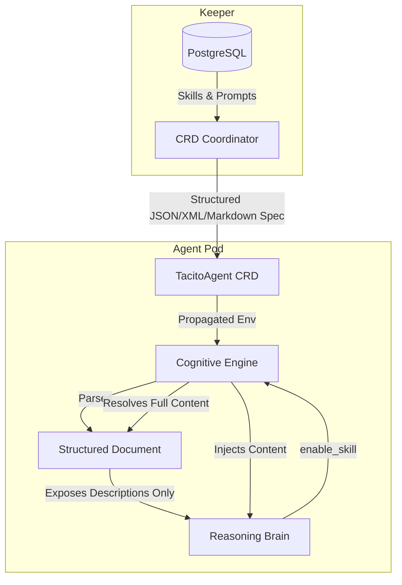

# BUG-M5.2: Unified Skills and Prompts Misinterpretation and Flattened Keeper-Agent Interface

| Field         | Value                                                              |
|---------------|--------------------------------------------------------------------|
| ID            | BUG-M5.2                                                           |
| Status        | CLOSED                                                             |
| Severity      | HIGH                                                               |
| Milestone     | M5 — Agent Core                                                    |
| Affects       | `internal/agent/application/service/cognitive_engine.go`, `internal/keeper/adapters/outbound/crd/crd_coordinator.go` |
| Violates      | SPEC-FR-M3.3, SPEC-FR-M3.4, SPEC-FR-M5.1, SPEC-FR-M5.10            |
| Discovered    | Architectural review and interface propagation alignment           |

## Problem Statement

The implementation of "skills" and "prompts" in Milestone 5 suffers from a unified architectural misinterpretation and interface flattening bottleneck. It is impossible to resolve one without addressing the other:

1. **Skills Misinterpreted as Tools**: Skills are currently implemented as collections of programmatic tool handlers (`skillPool map[string]map[string]ToolHandler`). This conflates procedural knowledge with interactive MCP tools, polluting the core reasoning layer.
2. **Flattened Interface Bottleneck**: The keeper-agent interface, managed by `K8sCRDCoordinator.ResolveAndSynthesizeSystemPrompt`, flattens all prompt templates and assigned skill name listings out-of-band at deploy-time into a single concatenated unstructured text block set as `Spec.SystemPrompt`.
3. **Missing Procedural Skill Content**: Because the interface is flattened, the actual procedural guidelines/content (`Content` of the skill) are completely omitted. Since the agent pod runs in stateless isolation, it has no access to the skill's instructions, making dynamic loading non-functional.
4. **No Support for Prompt Sets**: The agent receives a single pre-compiled prompt string, eliminating the ability to dynamically resolve, reference, or swap prompts within a "prompt set" based on execution context.

## Proposed Resolution Design (Structured Propagation)

To resolve these gaps without introducing runtime database/network dependencies, the keeper-agent interface must transition to a **structured document propagation pattern**.

Rather than propagating unstructured text, the operator will pass a single flattened but **structured document** (e.g. JSON, XML, or Markdown with explicit tag boundaries) containing:
- The active **prompt sets** (system prompt, behavioral templates, personality guidelines).
- The list of **skills** (names, descriptions, and their complete **procedural guidelines/contents**).

The agent's `CognitiveEngine` parses this structured document at startup. During execution:
1. It exposes only the prompt directives and the list of available skill names and descriptions to the brain.
2. The brain decides which skill is needed based on the descriptions.
3. The brain calls the `enable_skill` tool, passing the skill name.
4. The `CognitiveEngine` looks up the skill inside the parsed structured document and dynamically loads its full procedural `Content` to enrich the reasoning loop's subsequent history/context, keeping the context window minimal and clean.

## Affected Components and Files

| Component / File | Location | Issue |
|------------------|----------|-------|
| K8s CRD Coordinator | `internal/keeper/adapters/outbound/crd/crd_coordinator.go` | `ResolveAndSynthesizeSystemPrompt` flattens templates and skill lists into unstructured text. |
| TacitoAgent CRD | `pkg/kubernetes/apis/tacito/v1alpha1/tacitoagent_types.go` | `TacitoAgentSpec` only has a flat `SystemPrompt` field and lacks structured configuration fields. |
| Agent Cognitive Engine | `internal/agent/application/service/cognitive_engine.go` | Implements `skillPool` as `ToolHandler` maps and lacks parser logic for structured keeper specifications. |
| Agent Main Bootstrap | `cmd/agent/main.go` | Registers mock skill collections as executable tools. |

## Impact

1. **Broken Dynamic Skills**: The agent has no access to the raw instructions/contents of assigned skills, preventing the brain from dynamically applying procedural guidelines.
2. **Rigid Prompting**: The agent cannot dynamically adapt its system prompt or swap between prompt templates within a set.
3. **Architecture Pollution**: Conflates skills with interactive MCP tools, interfering with decoupled tool execution.

## Expected Behaviour

1. The keeper-agent propagation channel MUST utilize a single structured document format (JSON, XML, or tagged Markdown) containing both prompt configurations and complete skill definitions (including raw procedural contents).
2. The `CognitiveEngine` MUST parse this structured document at bootstrap.
3. The `CognitiveEngine` MUST register a skill-loading tool (e.g. `enable_skill`). When called, it retrieves the corresponding skill content from the parsed structured document and returns it as a tool observation to enrich the context dynamically.
4. All computational and programmatic tool execution must be decoupled and handled exclusively by MCP servers.

## Acceptance Criteria

1. **Structured Propagation**:
   - The generated CRD spec includes a structured format representing prompt templates and full skill contents.
   - The agent successfully parses this structured document at startup.
2. **Dynamic Procedural Enrichment**:
   - A mock brain observes available skills (names and descriptions).
   - The brain invokes the skill-loading tool, and the exact procedural instructions from the structured document are injected dynamically into the context.
   - No mock programmatic tool handlers remain compiled in the agent core binary.
